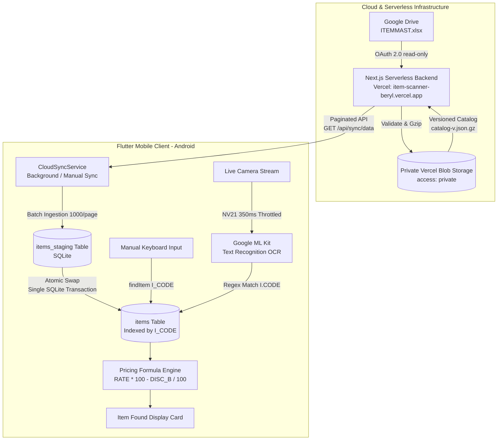
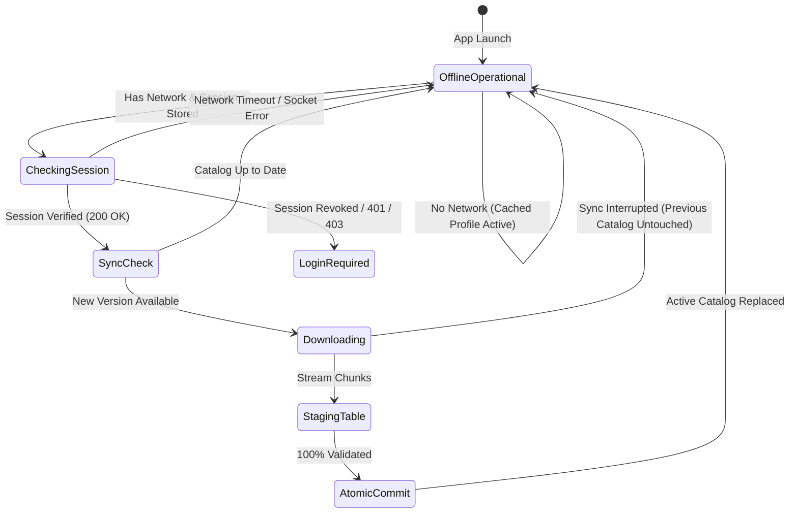
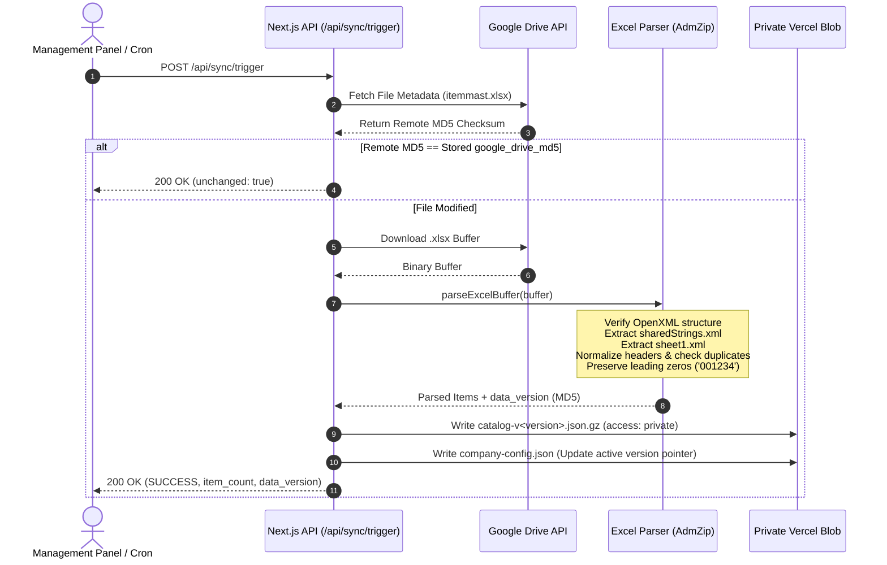

# Application Documentation: Item Scanner

**Repository:** `item_scanner`  
**Application Title:** Item Scanner (`ITEM MASTER`)  
**Package Name:** `com.example.item_scanner`  
**Production Backend URL:** `https://item-scanner-beryl.vercel.app`  
**Documentation Version:** 2.0 (Updated September 2026)  
**File Location:** `APP_DOCUMENTATION.md`  

---

## Table of Contents

1. [Project Overview](#1-project-overview)
2. [Current Production Architecture & Data Flow](#2-current-production-architecture--data-flow)
3. [Offline-First Architecture & Behavior](#3-offline-first-architecture--behavior)
4. [Actual Project Structure](#4-actual-project-structure)
5. [Flutter Mobile Application Architecture](#5-flutter-mobile-application-architecture)
6. [Next.js Serverless Backend Architecture](#6-nextjs-serverless-backend-architecture)
7. [Google Drive Integration](#7-google-drive-integration)
8. [Catalog Synchronization & Ingestion Pipeline](#8-catalog-synchronization--ingestion-pipeline)
9. [Current Production Data](#9-current-production-data)
10. [Android Build Configuration](#10-android-build-configuration)
11. [Production Flutter Backend Configuration](#11-production-flutter-backend-configuration)
12. [Testing, Validation & Benchmarks](#12-testing-validation--benchmarks)
13. [Developer Setup & Onboarding Guide](#13-developer-setup--onboarding-guide)
14. [Security Considerations](#14-security-considerations)
15. [Troubleshooting Guide](#15-troubleshooting-guide)
16. [Current Project Status](#16-current-project-status)
17. [Appendix: Outdated Information Removed](#17-appendix-outdated-information-removed)

---

## 1. Project Overview

### Application Identity
* **Flutter Package Name (`pubspec.yaml`):** `item_scanner`
* **Android Application ID / Namespace:** `com.example.item_scanner`
* **UI App Bar Title:** `ITEM MASTER`
* **Production Backend Service:** Next.js Serverless on Vercel (`https://item-scanner-beryl.vercel.app`)

### Purpose of the Application
`item_scanner` is a high-performance, offline-first mobile inventory lookup application engineered for retail, distribution, and warehouse environments. It eliminates product lookup latency by maintaining a fully indexed, relational SQLite catalog directly on the Android device. Warehouse staff and sales representatives can search products instantly by item code (`I_CODE`) via manual numeric entry or real-time camera optical character recognition (OCR), even when completely disconnected from cellular or Wi-Fi networks.

### Core Architecture Highlights
* **Offline-First SQLite Engine:** All item searches execute against local SQLite B-Tree indexes on the device with microsecond lookup speeds.
* **Camera OCR Code Scanning:** Uses Google ML Kit Text Recognition with real-time frame stream throttling to recognize printed `I.CODE` labels on shelf tags and boxes.
* **Serverless One-Company Backend:** Serverless Next.js (App Router) deployed on Vercel. Eliminates external relational database dependencies (no PostgreSQL, no Prisma, no Neon, and no dedicated VPS).
* **Private Vercel Blob Storage:** Persistent storage for backend configuration and versioned, gzipped catalog payloads stored securely with `access: 'private'`.
* **Google Drive Integration:** Authoritative spreadsheet data (`ITEMMAST.xlsx`) is fetched server-side from Google Drive via the official Google Drive API (OAuth 2.0, read-only scope).
* **Two-Phase Atomic Synchronization:** Spreadsheets are parsed, validated, and published server-side into private versioned blobs. Mobile devices download paginated catalog chunks into an `items_staging` table before an atomic single-transaction swap into the active `items` catalog.

---

## 2. Current Production Architecture & Data Flow

### Architecture Overview Diagram



### Complete End-to-End Data Flow

1. **Source Spreadsheet (`ITEMMAST.xlsx`):**  
   The business updates product quantities, prices, descriptions, and discounts in an Excel workbook stored in Google Drive.
2. **Backend Fetch via Google Drive API:**  
   The Next.js backend on Vercel requests the file contents using an encrypted OAuth 2.0 refresh token with read-only scope (`https://www.googleapis.com/auth/drive.readonly`). No public link sharing or open permissions are needed.
3. **Change Detection via `google_drive_md5`:**  
   The backend retrieves the file metadata and compares the remote MD5 checksum with the previously stored `google_drive_md5`. If unchanged, synchronization completes immediately with `{ unchanged: true }`.
4. **Server-Side Ingestion & Validation:**  
   If modified, the backend streams the `.xlsx` file through a fast OpenXML parser (`adm-zip`), validates required column headers (`I_CODE`, `ITEM_NAME`, `DESCRIBE`, `QUANTITY`, `RATE`, `DISC_PER`, `DISC_B`), checks for duplicates, and preserves leading zeros (e.g., `'001234'`).
5. **Private Versioned Blob Storage:**  
   The normalized items array is compressed with gzip and written to private Vercel Blob storage (`catalog-v<version>.json.gz`) using `access: 'private'`. The backend configuration blob (`company-config.json`) is atomically updated with the new active catalog pointer and metadata.
6. **Paginated Delivery to Mobile:**  
   The Flutter app queries `GET /api/sync/data?version=<local_version>&limit=1000&offset=0`. If `up_to_date: true`, zero items are downloaded. If a new version exists, pages are fetched sequentially.
7. **Local SQLite Staging & Atomic Swap:**  
   Incoming records are batch-inserted into `items_staging`. Upon downloading 100% of records, count validation occurs. An atomic SQLite transaction then clears `items`, inserts from `items_staging`, and clears `items_staging`.
8. **Instant Local Lookup:**  
   Product searches (manual numeric entry or real-time ML Kit OCR) query the local `items` table via index `idx_items_icode`. Results are passed to the pricing engine to calculate dynamic discounts in microseconds.

---

## 3. Offline-First Architecture & Behavior

`item_scanner` is architected with strict offline-first principles.



### Key Offline Invariants

1. **Zero-Network Searching:**  
   Scanning barcodes, typing item codes, or viewing product details **never** makes network requests. The user can perform thousands of lookups in an isolated basement or metal-clad warehouse without an internet connection.
2. **Startup Speed:**  
   The app launches and initializes local SQLite in under 100 ms, immediately presenting the search interface and total loaded item count without blocking on remote endpoints.
3. **Session Resilience:**  
   When the app opens without internet connectivity, `AuthService.restoreSession()` catches the network exception and falls back to the locally cached `CompanyInfo` profile. The app remains fully functional in offline mode.
4. **Catalog Integrity on Failed Sync:**  
   If an automatic or manual synchronization is interrupted (e.g., signal drops midway through a 50,000-item download), the download aborts, the temporary `items_staging` table is wiped clean, and the existing active `items` catalog remains 100% intact and searchable.
5. **Purpose of Internet Connection:**  
   Internet access is solely required for:
   * Initial company login.
   * Background or manual catalog synchronization with the Vercel backend.

---

## 4. Actual Project Structure

The project structure matches the repository layout:

```
item_scanner/
├── android/                             # Android native configuration
│   ├── app/
│   │   ├── build.gradle.kts            # compileSdk 37, targetSdk 36, minSdk 21
│   │   └── src/main/
│   │       ├── AndroidManifest.xml      # Camera permission & MainActivity
│   │       └── res/                     # App drawables, launcher icons, splash
│   ├── gradle/wrapper/
│   │   └── gradle-wrapper.properties    # Gradle 9.1.0 distribution
│   ├── build.gradle.kts                # Root build script
│   ├── gradle.properties               # Memory & worker optimization flags
│   ├── local.properties                # Flutter & Android SDK paths
│   └── settings.gradle.kts             # AGP 9.0.1, Kotlin 2.3.20
├── assets/
│   └── icons/
│       ├── app_icon.png                # Master application icon
│       └── splash_logo.png             # Native splash screen logo
├── backend/                             # Next.js Serverless Backend (Vercel)
│   ├── .data/                          # Local development storage (.gitignore)
│   ├── scripts/                        # Automated verification test suites
│   │   ├── test-credential-version.ts  # Credential reset & normalization tests
│   │   ├── test-private-blob.ts        # Private Vercel Blob adapter tests
│   │   ├── test-stage2.ts              # Authentication & company tests
│   │   ├── test-stage4.ts              # Single-company store & storage tests
│   │   ├── test-stage5.ts              # Google OAuth & Drive integration tests
│   │   └── test-stage6.ts              # XLSX parsing, atomicity & benchmarks
│   ├── src/
│   │   ├── app/
│   │   │   ├── admin/                  # Web administration panel
│   │   │   ├── api/
│   │   │   │   ├── auth/               # /login, /logout, /me endpoints
│   │   │   │   ├── company/            # /profile, /credentials endpoints
│   │   │   │   ├── google-drive/       # /auth-url, /callback, /status, /files, /select, /disconnect, /test
│   │   │   │   └── sync/               # /trigger, /status, /data endpoints
│   │   │   ├── layout.tsx
│   │   │   └── page.tsx                # Single-Company Management UI
│   │   └── lib/
│   │       ├── auth.ts                 # Bcrypt hashing & Jose JWT verification
│   │       ├── db.ts                   # SingleCompanyStore & credential bootstrap
│   │       ├── encryption.ts           # AES-256-GCM token encryption at rest
│   │       ├── excel-parser.ts         # Adm-Zip OpenXML streaming parser
│   │       ├── google-drive.ts         # Google OAuth & Drive API client
│   │       ├── response.ts             # Standardized JSON response helpers
│   │       ├── storage.ts              # StorageAdapter (VercelBlobStorage & LocalFileStorage)
│   │       └── types.ts                # Domain types & interfaces
│   ├── .env.example                    # Environment variable template
│   ├── package.json                    # Next.js 16, React 19, @vercel/blob 2.8
│   └── tsconfig.json                   # TypeScript configuration
├── lib/                                 # Flutter client source code
│   ├── models/
│   │   ├── company_info.dart           # Authenticated company data model
│   │   ├── sync_item.dart              # Catalog item model with string preservation
│   │   └── sync_state.dart             # Reactive synchronization state model
│   ├── screens/
│   │   ├── icode_scanner_screen.dart   # Camera preview, OCR frame processing & modal
│   │   └── login_screen.dart           # Company login UI & custom server configuration
│   ├── services/
│   │   ├── api_service.dart            # HTTP communication with Vercel backend
│   │   ├── auth_service.dart           # FlutterSecureStorage JWT & cached session
│   │   ├── cloud_sync_service.dart     # Bounded retry, chunked sync & staging logic
│   │   ├── database_service.dart       # SQLite database, staging tables, migrations & pricing
│   │   ├── excel_import_service.dart   # Legacy isolate streaming XLSX parser (fallback)
│   │   ├── excel_service.dart          # Legacy Excel byte decoder utility
│   │   └── google_drive_service.dart   # Legacy direct Sheets service (superseded by backend)
│   └── main.dart                       # Entry point, AuthGate, HomePage, search & UI
├── test/
│   ├── auth_test.dart                  # Authentication model and state unit tests
│   ├── cloud_sync_test.dart            # Comprehensive 30-test suite & perf benchmarks
│   └── widget_test.dart                # Basic widget initialization test
├── analysis_options.yaml                # Flutter linter configuration
├── convert_excel.py                     # Offline Python XLSX-to-SQLite conversion script
├── ITEMMAST.xlsx                        # Sample local item master spreadsheet
├── item_scanner.db                      # Local SQLite reference database
└── pubspec.yaml                         # Flutter dependencies and assets
```

---

## 5. Flutter Mobile Application Architecture

### 1. Presentation & Navigation Flow

* **`AuthGate` ([lib/main.dart](file:///d:/raman%20software/item_scanner/lib/main.dart)):**  
  Checks for an active session using `AuthService.restoreSession()`. Displays a branded splash animation while resolving credentials. If authenticated, directs to `HomePage`; otherwise, directs to `LoginScreen`.
* **`LoginScreen` ([lib/screens/login_screen.dart](file:///d:/raman%20software/item_scanner/lib/screens/login_screen.dart)):**  
  Prompts for company username and password. Features an expandable "Server Settings" accordion allowing developers and testers to point the client to a custom backend URL (e.g., local emulator `http://10.0.2.2:3000` or staging environment).
* **`HomePage` ([lib/main.dart](file:///d:/raman%20software/item_scanner/lib/main.dart)):**  
  * **Collapsible Header:** Shows brand icon, application title `ITEM MASTER`, and formatted `Synced DD/MM/YYYY hh:mm AM/PM` badge.
  * **Status Card:** Live status text and item count with quick-retry actions.
  * **Numeric Search Field:** Automatic instant search triggered when input length reaches $\ge 3$ digits.
  * **Action Buttons:** `SYNC DATABASE` (triggers `CloudSyncService.synchronize(force: true)`), `READ I.CODE` (opens camera scanner), and `SEARCH ITEM` (submits manual code).
  * **Item Details Card:** Slide-and-fade animated card displaying `I_CODE`, `ITEM NAME`, `DESCRIPTION`, `QUANTITY`, and calculated dynamic pricing.
  * **Company Account Sheet:** Bottom modal displaying company identity, username, account status, and a "Sign Out" action.
* **`ICodeScannerScreen` ([lib/screens/icode_scanner_screen.dart](file:///d:/raman%20software/item_scanner/lib/screens/icode_scanner_screen.dart)):**  
  Full-screen camera viewfinder featuring an oscillating laser scan line and custom corner brackets. Captures frames, extracts printed codes, queries SQLite, and presents an item verification bottom sheet.

### 2. Barcode & OCR Camera Scanning

* **Engine:** Google ML Kit Text Recognition (`google_mlkit_text_recognition: 0.17.1`) paired with `camera: ^0.12.0+2`.
* **Frame Throttling:** Live video stream buffers (`ImageFormatGroup.nv21`) are sampled at **350 ms intervals**. This throttling prevents CPU overheating and battery drain.
* **Regular Expression Matching:**  
  Raw OCR text strings are evaluated against the pattern:
  ```regex
  (?:I|1)\s*[._]?\s*CODE\s*[:\-]?\s*([0-9]{3,})
  ```
  * Tolerates optical character confusion (such as OCR reading digit `1` in place of letter `I`).
  * Matches label variants: `I.CODE: 40515`, `1-CODE 1234`, `ICODE: 99999`.
  * Requires a minimum of 3 digits.
* **Instant Termination:** Upon a valid match, camera image streaming is halted immediately, and the app queries SQLite via `findItem(scannedCode)`.

### 3. Dynamic Discounted Rate Calculation

In retail and wholesale workflows, the raw spreadsheet contains `RATE` and `DISC_B` (discount percentage B). The pricing engine in `DatabaseService.calculateDiscountedRate()` calculates the final discounted customer price dynamically:

$$\text{Final Rate} = \frac{\text{RATE} \times (100 - \text{DISC\_B})}{100}$$

* Automatically strips currency marks (`₹`, `Rs.`, `Rs`), percentage signs (`%`), and thousands commas (`,`).
* Formats values to two decimal places, trimming trailing `.00`.
* Safely falls back to the original `RATE` string if values cannot be parsed numerically.

### 4. State Management

The Flutter application relies on built-in **`StatefulWidget` / `setState()`** for UI components and **`ValueNotifier<SyncState>`** inside `CloudSyncService` for reactive, decoupled synchronization state broadcasting across screens.

---

## 6. Next.js Serverless Backend Architecture

The backend is built with Next.js (App Router) deployed on Vercel.

### 1. One-Company Architecture
* **Single Company Scope:** Optimized for single-organization operation. Removed multi-tenant company registration (`/api/company/register`) and dynamic tenant switching.
* **Zero Relational Database Dependencies:** Does not require PostgreSQL, Prisma, Neon, Supabase, or external database connection pooling.
* **Durable Storage Adapter (`StorageAdapter`):**
  * **Production (`VercelBlobStorage`):** Uses `@vercel/blob` with `access: 'private'`. Data files (`catalog-v<version>.json.gz`) and configuration (`company-config.json`) are stored in private Vercel Blob storage. Files are read server-side using the authenticated `get()` SDK method with `BLOB_READ_WRITE_TOKEN`. **Blobs are never exposed to public internet URLs.**
  * **Development / Testing (`LocalFileStorage`):** Stores config and gzipped catalog files locally inside `.data/`.
  * **Warm In-Memory Cache:** `SingleCompanyStore` caches configuration and active catalogs in memory for sub-millisecond execution in warm serverless instances while ensuring durable persistence.

### 2. API Routes Summary

| Route | Method | Access | Description |
| :--- | :--- | :--- | :--- |
| `/api/auth/login` | `POST` | Public | Authenticates company with username & password. Returns JWT token and sets httpOnly cookie. |
| `/api/auth/logout` | `POST` | Public | Clears authenticated session cookies. |
| `/api/auth/me` | `GET` | Bearer Token | Returns current authenticated company profile (excluding secrets). |
| `/api/company/profile` | `GET`, `PUT` | Bearer Token | Retrieves or updates company display name. |
| `/api/company/credentials` | `PUT` | Bearer Token | Updates username and password after verifying current credentials. |
| `/api/google-drive/auth-url` | `GET` | Bearer Token | Generates Google OAuth URL with cryptographic HMAC-signed state. |
| `/api/google-drive/callback` | `GET` | Public (OAuth) | Validates state, exchanges code for tokens, encrypts refresh token with AES-256-GCM. |
| `/api/google-drive/status` | `GET` | Bearer Token | Returns Google Drive connection status and selected spreadsheet name. |
| `/api/google-drive/files` | `GET` | Bearer Token | Lists accessible `.xlsx` spreadsheets from connected Google Drive. |
| `/api/google-drive/select` | `POST` | Bearer Token | Sets the active `ITEMMAST.xlsx` file ID and file name. |
| `/api/google-drive/disconnect` | `POST` | Bearer Token | Safely revokes and unlinks Google Drive tokens without touching Drive files. |
| `/api/google-drive/test` | `GET` | Bearer Token | Tests authorization health and token refresh validity. |
| `/api/sync/trigger` | `POST` | Bearer Token | Manually triggers server-side download, validation, and publication of Excel catalog. |
| `/api/sync/status` | `GET` | Bearer Token | Returns live sync status, `item_count`, `data_version`, and timestamps. |
| `/api/sync/data` | `GET` | Bearer Token | Serves paginated catalog rows (`?limit=1000&offset=0`). Supports `?version=xxx` for no-change check (`up_to_date: true`). |

---

## 7. Google Drive Integration

### 1. Scope and Access
* **Service:** Google Drive API v3 via `google-auth-library`.
* **OAuth 2.0 Scopes:**
  * `https://www.googleapis.com/auth/drive.readonly` (Read-only access to files and metadata).
  * `https://www.googleapis.com/auth/userinfo.email` (Verifies authorized Google account identity).
* **Strict Read-Only Permission:** The application cannot modify, overwrite, delete, or create files on the user's Google Drive.

### 2. OAuth Handshake & State Protection
* The authorization URL includes a cryptographically signed `state` parameter:
  $$\text{state} = \text{base64url}(\{\text{company\_id}, \text{timestamp}, \text{nonce}\}) + '.' + \text{HMAC-SHA256}(\text{data}, \text{JWT\_SECRET})$$
* Validated on redirect callback: prevents Cross-Site Request Forgery (CSRF) and session hijacking. States expire after 15 minutes.

### 3. Token Encryption at Rest
* Google OAuth refresh tokens are encrypted at rest before persistence using **AES-256-GCM**:
  * Ciphertext format: `iv:authTag:encryptedData` (Hex-encoded).
  * Encryption key: Derived from 32-byte (64-character hex) environment variable `ENCRYPTION_KEY`.
  * Tokens are decrypted exclusively in server memory when calling the Drive API. Raw tokens are never sent in API responses.

---

## 8. Catalog Synchronization & Ingestion Pipeline

### 1. Server-Side Processing (`excel-parser.ts`)



* **Mandatory Column Validation:** Requires `I_CODE`, `ITEM_NAME`, `DESCRIBE`, `QUANTITY`, `RATE`, `DISC_PER`, and `DISC_B`. Accepts casing variations (`disc_b`, `DISC B`).
* **Leading Zero Preservation:** Item codes like `'000456'` are strictly preserved as strings, avoiding numeric type coercion.
* **Duplicate Rejection:** If duplicate `I_CODE` entries exist, the sync throws `ExcelValidationError` and halts.
* **Strict Versioning Separation:**
  * `google_drive_md5`: MD5 hash of the raw `.xlsx` file on Drive. Used by Next.js to detect remote file updates.
  * `data_version`: Deterministic MD5 hash calculated over normalized catalog rows:
    $$\text{MD5}\left(\text{item\_count} + \sum (\text{i\_code} \mid \text{rate} \mid \text{quantity} \mid \text{disc\_per} \mid \text{disc\_b};)\right)$$
    Used by Flutter to verify catalog synchronization needs.

### 2. Client-Side Mobile Ingestion (`CloudSyncService`)

```mermaid
sequenceDiagram
    autonumber
    participant App as Flutter App
    participant API as Next.js API (/api/sync/data)
    participant DB as SQLite (items & items_staging)
    participant Prefs as SharedPreferences

    App->>API: GET /api/sync/data?version=<local_data_version>&limit=1000&offset=0
    alt Version Matches (up_to_date: true)
        API-->>App: { up_to_date: true, items: [] }
        App->>Prefs: Update last_sync_check_timestamp
    else New Catalog Available
        API-->>App: { up_to_date: false, item_count: N, data_version: V, items: [Page 1] }
        App->>DB: clearStaging()
        App->>DB: insertStagingBatch(Page 1)
        loop Remaining Pages
            App->>API: GET /api/sync/data?limit=1000&offset=downloaded
            API-->>App: Items Chunk
            App->>DB: insertStagingBatch(Chunk)
        end
        App->>DB: getStagingCount() (Verify staged == N)
        App->>DB: atomicallyPublishStaging() [Single SQLite Transaction]
        Note over DB: DELETE FROM items;<br/>INSERT INTO items SELECT * FROM items_staging;<br/>DELETE FROM items_staging;
        App->>Prefs: Save catalog_data_version = V & last_sync_time
    end
```

* **True Staging Table (`items_staging`):** All downloaded chunks are inserted into `items_staging`.
* **Atomic Replacement:** Once validation succeeds, `atomicallyPublishStaging()` executes inside an exclusive SQLite transaction. If any failure occurs, the transaction rolls back, leaving the active catalog untouched.
* **Automatic Sync Scope:**
  * Runs an asynchronous non-blocking check on app launch.
  * Checks periodically every 15 minutes while the app is running in the foreground.
  * **Does not run background daemons when the app is suspended or terminated.**
* **Rate Limiting & Bounded Backoff:** Transient network/5xx failures retry using bounded exponential backoff (2s, 5s, 15s) and abort safely. Permanent failures (401, 403, duplicate codes) fail immediately with zero retries.

---

## 9. Current Production Data

* **Current Synchronized Catalog Size:** Approximately **6,615 items**.
* **Scalability:** 6,615 represents the current working dataset size. It is **not** a hardcoded ceiling. The application architecture and SQLite engine are benchmarked and verified for datasets up to 100,000+ items.

---

## 10. Android Build Configuration

The Android native project configuration:

| Component | Target Version | Configuration File |
| :--- | :--- | :--- |
| **Compile SDK** | `37` (Android 16 preview) | `android/app/build.gradle.kts` |
| **Target SDK** | `36` (Android 16) | `android/app/build.gradle.kts` |
| **Min SDK** | `21` (Android 5.0 Lollipop) | `android/app/build.gradle.kts` |
| **Android Gradle Plugin (AGP)**| `9.0.1` | `android/settings.gradle.kts` |
| **Gradle Distribution** | `9.1.0` | `android/gradle/wrapper/gradle-wrapper.properties` |
| **Kotlin Compiler** | `2.3.20` (JVM Target 17) | `android/app/build.gradle.kts` |
| **Java Development Kit** | Java 21 | Build runtime |

### Compile SDK 37 Requirement
`flutter_secure_storage: ^11.0.0` requires `compileSdk = 37`. In `android/gradle.properties`, the flag `android.suppressUnsupportedCompileSdk=37.0` suppresses compiler warnings while building against AGP 9.0.1.

### Development Machine Build Optimization
To prevent Gradle out-of-memory crashes on developer workstations, `android/gradle.properties` defines:
```properties
org.gradle.jvmargs=-Xmx1536m -XX:MaxMetaspaceSize=384m -XX:ReservedCodeCacheSize=128m
org.gradle.parallel=false
org.gradle.workers.max=2
kotlin.daemon.jvmargs=-Xmx512m
```

### Release Build Output
Release APK builds have been generated:
* Artifact: `build/app/outputs/flutter-apk/app-release.apk` (~97.4 MB)

---

## 11. Production Flutter Backend Configuration

* **Production Base URL:** `https://item-scanner-beryl.vercel.app` (configured as default in `ApiService`).
* **Compile-Time Custom Override:**  
  Developers can override the default backend URL during build or run:
  ```bash
  flutter run --dart-define=BACKEND_BASE_URL=http://10.0.2.2:3000
  ```
* **Runtime Custom Override:**  
  The `LoginScreen` contains an expandable server URL input field that persists custom URLs into `SharedPreferences` (`api_base_url_custom`).

---

## 12. Testing, Validation & Benchmarks

### 1. Flutter Test Suite (30/30 Passed)
The Flutter test suite verifies models, authentication states, synchronization, error handling, atomicity, and performance:

* `test/auth_test.dart` (3 tests):
  * CompanyInfo serialization and deserialization.
  * Session restoration when no token exists.
  * Logout and credential clearing.
* `test/cloud_sync_test.dart` (26 tests):
  * **Category 1:** Sync data models, string preservation, empty I_CODE rejection.
  * **Category 2:** SyncState reactive model transitions and copyWith.
  * **Category 3:** Unauthenticated rejection and 401 session expiry handling.
  * **Category 4:** Versioning and no-change optimization (`up_to_date: true`).
  * **Category 5:** Multi-page pagination and chunk assembly.
  * **Category 6:** Duplicate `I_CODE` detection and dataset rejection.
  * **Category 7:** Atomic rollback: existing catalog remains untouched on mid-download failure.
  * **Category 8 & 13:** Performance benchmarks (10,000, 50,000, and 100,000 items).
  * **Category 9:** Minimum 15-minute sync interval skipping and forced sync bypass.
  * **Category 10:** Transient network retry with exponential backoff.
  * **Category 11:** Non-transient errors (401, 403, duplicate code) aborting without retries.
  * **Category 12:** Non-blocking scanner access during active background sync.
* `test/widget_test.dart` (1 test):
  * Application initialization and widget tree startup.

### 2. Static Analysis
* `flutter analyze`: **No issues found!** (Zero errors, zero warnings, zero lints).

### 3. Backend Test Suite (82+ Passed)
The backend test suite executes across 6 scripts:
* `test-stage2.ts`: Authentication, login, profile, and credential management (13 tests).
* `test-stage4.ts`: Single-company storage adapter and cold-start state persistence.
* `test-stage5.ts`: Google OAuth handshake, state signatures, and Drive API integration.
* `test-stage6.ts`: Excel parsing, duplicate validation, atomic publication, and benchmarks (27 tests).
* `test-private-blob.ts`: Private Vercel Blob adapter with `access: 'private'` (7 tests).
* `test-credential-version.ts`: Bcrypt normalization and versioned credential reset (8 suites / 13 validations).

### 4. Local Performance Benchmarks
Measured on the development workstation:

| Item Count | Ingestion & Synchronization Time | Local SQLite Lookup Latency |
| :--- | :--- | :--- |
| **10,000 items** | ~66 – 80 ms | ~425 µs |
| **50,000 items** | ~147 – 153 ms | ~27 µs |
| **100,000 items** | ~415 – 421 ms | ~37 µs |

> [!NOTE]
> Benchmark figures reflect local development testing. They demonstrate linear scaling and microsecond query capabilities; they are not guaranteed production SLAs.

---

## 13. Developer Setup & Onboarding Guide

### Prerequisites
* **Flutter SDK:** `^3.27.0` (Dart SDK `^3.12.2`)
* **Java Development Kit (JDK):** Version 21 (with `JAVA_HOME` set)
* **Android SDK:** Compile SDK 37, Platform-Tools, Build-Tools 36+
* **Node.js:** `v20.x` or higher (LTS recommended)
* **npm:** `v10.x` or higher

### 1. Flutter Client Setup
```bash
# Clone the repository
git clone https://github.com/the-Manoj-Kumar-code/item_scanner.git
cd item_scanner

# Fetch dependencies
flutter pub get

# Verify environment
flutter doctor

# Run Flutter tests
flutter test

# Run static analysis
flutter analyze
```

### 2. Backend Setup
```bash
cd backend

# Install npm dependencies
npm install

# Copy environment template
cp .env.example .env.local

# Run backend automated test suites
npm test

# Start Next.js local development server
npm run dev
```

### 3. Backend Environment Variables Reference

Configure these in `backend/.env.local` or the Vercel Dashboard. **Names only — never commit secrets into source control**:

| Variable Name | Required | Description |
| :--- | :--- | :--- |
| `COMPANY_NAME` | No | Organization display name (defaults to "Item Master Company"). |
| `ADMIN_USERNAME` | No | Admin login username (defaults to "admin"). |
| `ADMIN_PASSWORD_HASH` | No | Bcrypt hash of admin password. |
| `ADMIN_CREDENTIALS_VERSION` | No | Version tag to force credential resets on deploy. |
| `JWT_SECRET` | Yes | Minimum 32-character secret for signing session tokens. |
| `NODE_ENV` | Yes | `development` or `production`. |
| `APP_URL` | Yes | Base URL of backend (e.g. `https://item-scanner-beryl.vercel.app`). |
| `GOOGLE_CLIENT_ID` | Yes | Google Cloud Console OAuth 2.0 Web Client ID. |
| `GOOGLE_CLIENT_SECRET` | Yes | Google Cloud Console OAuth 2.0 Client Secret. |
| `GOOGLE_REDIRECT_URI` | Yes | Callback URL (`.../api/google-drive/callback`). |
| `ENCRYPTION_KEY` | Yes | 64-character hex string (32 bytes) for AES-256-GCM token encryption. |
| `BLOB_READ_WRITE_TOKEN` | Yes (Vercel) | Automatically injected when linking Vercel Blob store. |

### 4. Running the Flutter App Locally

```bash
# Android Emulator (pointing to local Next.js server on host machine)
flutter run -d android --dart-define=BACKEND_BASE_URL=http://10.0.2.2:3000

# Physical Android Device (pointing to production Vercel backend)
flutter run -d <device_id>

# Windows Desktop (for rapid UI development)
flutter run -d windows
```

### 5. Production Build Commands

```bash
# Build Android Release APK
flutter build apk --release

# Build Android App Bundle for Google Play
flutter build appbundle --release
```

---

## 14. Security Considerations

* **Token Storage:** Mobile JWT authentication tokens are stored in encrypted platform keychains via `FlutterSecureStorage` (Android Keystore / EncryptedSharedPreferences).
* **Token Encryption at Rest:** Google Drive refresh tokens are encrypted on the backend with AES-256-GCM using `ENCRYPTION_KEY`. Plaintext tokens are never stored in databases or blobs.
* **Private Blob Storage:** Vercel Blob stores are created with `access: 'private'`. Read operations occur server-side through authenticated SDK calls; raw blob URLs are never shared with clients.
* **Camera Stream Privacy:** Real-time camera frames are processed entirely on-device by Google ML Kit models. No video streams or photos are stored on disk or transmitted over the network.
* **Safe Error Handling:** API responses return sanitized error messages. Internal stack traces, database keys, and configuration secrets are stripped from responses.
* **Session Cookie Hardening:** Web management sessions use `httpOnly`, `sameSite=lax`, and `secure` (in production) cookies.

---

## 15. Troubleshooting Guide

### 1. Google OAuth Redirect URI Mismatch (`redirect_uri_mismatch`)
* **Cause:** The redirect URI sent by the backend does not match the URI registered in Google Cloud Console.
* **Resolution:** Ensure `GOOGLE_REDIRECT_URI` in Vercel environment variables matches Google Cloud Console credentials under **Authorized redirect URIs**:
  `https://item-scanner-beryl.vercel.app/api/google-drive/callback`

### 2. Vercel Environment Variables Not Active
* **Cause:** In Vercel, adding or changing environment variables does not affect running deployments automatically.
* **Resolution:** Trigger a new deployment (Redeploy with "Clear Build Cache") in the Vercel Dashboard for updated variables to take effect.

### 3. Google Drive Connection or Refresh Token Expiration
* **Cause:** User changed their Google password, or the OAuth consent screen is in "Testing" mode where refresh tokens expire after 7 days.
* **Resolution:** In Google Cloud Console, publish the app to "In production" status. Disconnect and reconnect Google Drive in the web management panel to generate a fresh refresh token.

### 4. Synchronization Failure: Duplicate `I_CODE`
* **Cause:** The spreadsheet contains two or more rows with the same `I_CODE`.
* **Resolution:** Open the spreadsheet in Google Drive, identify the duplicated code indicated in the sync error message, remove or rename duplicates, and trigger sync again.

### 5. Android Build Fails with `Unsupported compileSdk 37`
* **Cause:** Building with an AGP version that flags compileSdk 37 as unverified.
* **Resolution:** Ensure `android.suppressUnsupportedCompileSdk=37.0` is present in `android/gradle.properties`.

### 6. Flutter Connects to Wrong Backend URL
* **Cause:** Custom URL in SharedPreferences or incorrect `--dart-define`.
* **Resolution:** Tap the "Server Settings" toggle on the `LoginScreen`, verify the backend address, or tap "Reset to Default" to restore `https://item-scanner-beryl.vercel.app`.

### 7. Offline Authentication Error on App Launch
* **Cause:** Opening the app without network when no previous session was cached.
* **Resolution:** An initial successful login requires internet connectivity. Once logged in, subsequent offline opens use the cached profile automatically.

---

## 16. Current Project Status

| Component / Feature | Implementation State | Testing State | Production Configured |
| :--- | :---: | :---: | :---: |
| **Offline SQLite Catalog & Indexing** | Implemented | 30/30 Flutter Tests Passed | Yes |
| **ML Kit Camera OCR Scanning** | Implemented | Verified on Android Device | Yes |
| **Dynamic Discount Pricing Engine** | Implemented | Unit Tested | Yes |
| **One-Company Serverless Backend** | Implemented | 82+ Tests Passed | Deployed on Vercel |
| **Private Vercel Blob Storage** | Implemented | 7 Blob Tests Passed | Yes (`access: private`) |
| **Google Drive OAuth 2.0 Integration** | Implemented | Mock / Integration Tested | Configured (Requires Live Drive Setup) |
| **Two-Phase Versioned Catalog Sync** | Implemented | Integration Tested | Yes |
| **Mobile Atomic Staging & Rollback** | Implemented | Atomicity Tests Passed | Yes |
| **Mobile Session Restore (Offline Fallback)**| Implemented | Unit Tested | Yes |
| **Android Release APK** | Implemented | Built (`app-release.apk`) | Yes (compileSdk 37, AGP 9.0.1) |
| **1D Optical Barcode Decoding** | Not Implemented | — | Future Consideration |
| **Multi-Column Full-Text Search (FTS5)** | Not Implemented | — | Future Consideration |
| **Background Daemons When Suspended** | Not Implemented | — | Intentional Architecture Choice |

---

## 17. Appendix: Outdated Information Removed

The following obsolete concepts from early prototypes and prior specifications have been removed from the current documentation:

1. **Multi-Company / PostgreSQL / Prisma / Neon Architecture:**  
   Removed all references to multi-tenant schemas (`companies`, `company_items`), Prisma migrations, `DATABASE_URL`, and company registration APIs. The project operates on a permanent single-company serverless model.
2. **Unauthenticated Public Google Sheets Export:**  
   Removed references to public export URLs (`/export?format=xlsx`) and link-sharing requirements. The current architecture uses the official Google Drive API via server-side OAuth 2.0.
3. **Public Vercel Blob Storage:**  
   Corrected all descriptions of Vercel Blob storage. Storage is strictly private (`access: 'private'`) and accessed via authenticated server-side calls.
4. **Outdated Android SDK 36 Configuration:**  
   Updated compileSdk to 37 (mandated by `flutter_secure_storage`), AGP to 9.0.1, Gradle to 9.1.0, and documented workstation memory flags.
5. **Localhost-Only Deployment Assumptions:**  
   Removed assumptions that the backend is only local. Documented the active Vercel deployment URL `https://item-scanner-beryl.vercel.app`.
