# Application Documentation: Item Scanner

**Repository:** `item_scanner`  
**Application Title:** Item Scanner (`ITEM MASTER`)  
**Package Name:** `com.example.item_scanner`  
**Documentation Date:** September 2026  
**File Location:** `APP_DOCUMENTATION.md`

---

## Table of Contents

1. [Project Overview](#1-project-overview)
2. [Project Structure](#2-project-structure)
3. [Application Flow](#3-application-flow)
4. [Features](#4-features)
5. [Screens and UI](#5-screens-and-ui)
6. [Barcode & Optical Code Scanning](#6-barcode--optical-code-scanning)
7. [Excel / Item Master Processing](#7-excel--item-master-processing)
8. [Google Drive Synchronization](#8-google-drive-synchronization)
9. [Data Flow & Architecture](#9-data-flow--architecture)
10. [State Management](#10-state-management)
11. [Dependencies](#11-dependencies)
12. [Configuration & Environment](#12-configuration--environment)
13. [Platform Permissions](#13-platform-permissions)
14. [Error Handling](#14-error-handling)
15. [Performance & Optimization](#15-performance--optimization)
16. [Security Considerations](#16-security-considerations)
17. [Build and Run Instructions](#17-build-and-run-instructions)
18. [Known Limitations](#18-known-limitations)
19. [Future Improvement Suggestions](#19-future-improvement-suggestions)
20. [Technical Summary](#20-technical-summary)

---

## 1. Project Overview

### Application Name
* **Package Name (`pubspec.yaml`):** `item_scanner`
* **Android Application Label (`AndroidManifest.xml`):** `item_scanner`
* **iOS Bundle Display Name (`Info.plist`):** `Item Scanner`
* **UI App Bar Title:** `ITEM MASTER`

### Purpose of the Application
`item_scanner` is an offline-first mobile inventory lookup utility designed to eliminate lookup latency in warehouse and retail environments. It enables users to search for products instantly by item code (`I_CODE`), either via keyboard entry or real-time camera text recognition (OCR). The application maintains an indexed local SQLite database synchronized automatically or manually from a remote Google Drive spreadsheet.

### Main Use Case
Retail and warehouse personnel check product details (Item Name, Description, Quantity, and dynamically calculated discounted pricing based on `RATE` and `DISC_B` fields) directly on mobile devices even with intermittent or zero internet connectivity.

### Technology Stack
* **Framework:** Flutter (Material 3 Dark Theme)
* **Programming Language:** Dart (SDK `^3.12.2`)
* **Local Database:** SQLite via `sqflite`
* **Computer Vision / OCR:** Google ML Kit Text Recognition (`google_mlkit_text_recognition`) & Flutter `camera`
* **Data Processing:** `archive` (direct XML streaming) & `excel` package
* **Networking:** Dart standard `http` client
* **Local Key-Value Cache:** `shared_preferences`
* **Typography & UI:** `google_fonts` (Outfit font family)
* **Offline Preprocessing:** Python 3 (`openpyxl`, `sqlite3`)

---

## 2. Project Structure

```
item_scanner/
├── android/                        # Android native project configuration
│   ├── app/
│   │   ├── build.gradle.kts       # Android build settings (compileSdk 36, minSdk 21)
│   │   └── src/main/
│   │       ├── AndroidManifest.xml # Camera permission, launcher activity
│   │       └── res/                # App icons, splash drawables, styles
│   ├── build.gradle.kts           # Root Gradle build script
│   ├── local.properties           # Local SDK paths and Flutter version config
│   └── settings.gradle.kts        # Plugin management repositories
├── assets/                         # Bundled static assets
│   ├── database/                  # Asset database placeholder directory (empty)
│   └── icons/
│       ├── app_icon.png           # Master application icon asset
│       └── splash_logo.png        # Splash screen logo asset
├── ios/                            # iOS native runner project
│   ├── Runner/
│   │   ├── Info.plist             # iOS application configuration
│   │   └── Assets.xcassets        # iOS launch icons and splash assets
│   └── Runner.xcodeproj
├── lib/                            # Application Dart source code
│   ├── main.dart                  # Application entry point, Home screen, sync & search logic
│   ├── screens/
│   │   └── icode_scanner_screen.dart # Real-time camera OCR scanner & detection modal
│   └── services/
│       ├── database_service.dart     # SQLite database management, migrations & rate calculations
│       ├── excel_import_service.dart # Background isolate streaming XLSX parser & SQLite batch loader
│       ├── excel_service.dart        # Fallback Excel byte reader utility
│       └── google_drive_service.dart # Google Sheets remote download & MD5 hashing service
├── linux/                          # Linux desktop native platform files
├── macos/                          # macOS desktop native platform files
├── test/
│   └── widget_test.dart           # Basic widget initialization test
├── web/                            # Web platform runner, manifest, and icons
├── windows/                        # Windows desktop C++ runner files
├── analysis_options.yaml           # Linting rules referencing package:flutter_lints
├── convert_excel.py                # Standalone Python script for offline XLSX to SQLite conversion
├── ITEMMAST.xlsx                   # Sample/local item master Excel file
├── item_scanner.db                 # Local SQLite database file generated by conversion script
└── pubspec.yaml                    # Flutter project dependencies, assets, and metadata
```

### Core Source Files Summary
* **[lib/main.dart](file:///d:/raman%20software/item_scanner/lib/main.dart)**: Houses `ItemScannerApp`, `HomePage`, and `_HomePageState`. Manages the full search lifecycle, animation controllers, status messages, daily auto-sync checks, manual sync trigger, and item details presentation.
* **[lib/screens/icode_scanner_screen.dart](file:///d:/raman%20software/item_scanner/lib/screens/icode_scanner_screen.dart)**: Implements camera feed initialization, image stream throttling (350 ms), NV21 image buffer conversion, Google ML Kit OCR processing, regex extraction of `I_CODE`, database query on detection, and item found / not found modal bottom sheet.
* **[lib/services/database_service.dart](file:///d:/raman%20software/item_scanner/lib/services/database_service.dart)**: Encapsulates `sqflite` operations: schema definition (version 2 with `DISC_B`), `I_CODE` indexing, single item querying (`findItem`), safe database replacement with automatic backup/restore, and the static calculation function `calculateDiscountedRate`.
* **[lib/services/excel_import_service.dart](file:///d:/raman%20software/item_scanner/lib/services/excel_import_service.dart)**: High-speed Excel importer running off the main thread via `compute()`. Extracts rows using a custom streaming XML parser (`_fastParseXlsx`) and falls back to `_fallbackParseWithExcel`. Inserts records into a temporary SQLite database in batches of 2,000 rows within transactions, creates the B-Tree index post-insert, and validates total row count.
* **[lib/services/google_drive_service.dart](file:///d:/raman%20software/item_scanner/lib/services/google_drive_service.dart)**: Interacts with Google Sheets using public XLSX export URLs. Downloads spreadsheet bytes, calculates MD5 hashes using `crypto`, and manages temporary file persistence.
* **[lib/services/excel_service.dart](file:///d:/raman%20software/item_scanner/lib/services/excel_service.dart)**: Secondary helper service for synchronous in-memory decoding of Excel byte arrays.
* **[convert_excel.py](file:///d:/raman%20software/item_scanner/convert_excel.py)**: Offline Python conversion script utilizing `openpyxl` to parse `itemmast.xlsx` and insert into `item_scanner.db` in batches of 1,000.

---

## 3. Application Flow

```mermaid
sequenceDiagram
    autonumber
    actor User
    participant App as HomePage (main.dart)
    participant Prefs as SharedPreferences
    participant GDrive as GoogleDriveService
    participant Import as ExcelImportService
    participant DB as DatabaseService
    participant Cam as ICodeScannerScreen

    User->>App: Launch App
    App->>Prefs: Load last_sync_time & sync date
    App->>DB: initializeDatabase() -> getItemCount()
    DB-->>App: Return total items loaded
    
    rect rgb(20, 30, 45)
    Note over App,GDrive: Daily Auto-Sync Check
    App->>Prefs: Check last_auto_sync_date
    opt Needs Auto-Sync (New day or schema migration)
        App->>GDrive: downloadAndHash()
        GDrive-->>App: Return remoteVersion & bytes
        alt Remote Hash != Local Hash
            App->>Import: importExcel(bytes, tempDbPath) [Background Isolate]
            Import-->>App: Batch insert & return count
            App->>DB: replaceDatabase(tempDb) [Backup & Swap]
            App->>Prefs: Save new database_version & last_sync_time
        end
    end
    end

    alt Manual Keyboard Search
        User->>App: Type I_CODE in Search Box
        App->>DB: findItem(code)
        DB-->>App: Query result Map
        App->>User: Animate Item Found Card (or Not Found Banner)
    else Camera OCR Scan
        User->>App: Tap "READ I.CODE"
        App->>Cam: Push ICodeScannerScreen
        Cam->>Cam: Initialize camera & stream NV21 frames
        loop Every 350ms
            Cam->>Cam: ML Kit Text Recognition
            Cam->>Cam: Regex match: I.CODE: ([0-9]{3,})
        end
        Cam->>DB: findItem(scannedCode)
        DB-->>Cam: Item Map
        Cam->>User: Display Item Found Sheet
        User->>Cam: Tap "DONE"
        Cam->>App: Pop with scannedCode
        App->>App: Update text controller & trigger searchItem()
    else Manual Sync
        User->>App: Tap "SYNC DATABASE"
        App->>GDrive: downloadExcel()
        App->>Import: importExcel() [Background Isolate]
        App->>DB: replaceDatabase()
        App->>User: Update UI ($count items synchronized)
    end
```



---

## 4. Features

* **Offline-First SQLite Storage:** All product queries execute against a local SQLite database (`item_scanner.db`) with zero network latency.
* **Indexed Microsecond Search:** B-Tree index on `I_CODE` ensures searches typically complete in under 500 microseconds.
* **Real-Time Text Recognition (OCR):** Camera feed streams live frames to Google ML Kit to detect printed item codes (`I.CODE: <digits>`) without needing standard 1D barcodes.
* **Smart Image Frame Throttling:** OCR processing is throttled to 350 ms intervals to avoid thermal throttling and battery drain.
* **Direct XML Streaming XLSX Parser:** Reads zipped XML sheets and shared strings directly in a background Dart isolate, parsing 50,000+ items in ~1 second.
* **Two-Tier Fallback Parsing:** If the fast streaming ZIP reader encounters non-standard formats, it automatically delegates to the `excel` package decoder.
* **Atomic Database Replacement with Rollback:** During database synchronization, the existing SQLite database is backed up (`.backup`). If file replacement or count validation fails, the previous database is automatically restored.
* **Cloud Spreadsheet Synchronization:** Synchronizes directly from Google Drive / Google Sheets via the public export endpoint.
* **Daily Automated Sync:** Runs update check once per calendar day on app startup; skips network check on subsequent opens on the same day.
* **Automatic Discounted Rate Calculation:** Replaces standard rate with dynamic pricing computed via formula:  
  $$\text{Final Rate} = \frac{\text{RATE} \times (100 - \text{DISC\_B})}{100}$$
  Gracefully handles missing, blank, percentage-formatted, or currency-tagged values.
* **Material 3 Dark Theme UI:** Designed with high-contrast neon accents, animated transitions (`SlideTransition`, `FadeTransition`, `ScaleTransition`), and custom canvas corner-bracket viewfinder.

---

## 5. Screens and UI

### 1. Home Screen (`HomePage`)
* **File Location:** [lib/main.dart](file:///d:/raman%20software/item_scanner/lib/main.dart#L43-L512)
* **Purpose:** Primary hub for manual item code search, initiating camera scans, monitoring database status, and triggering cloud synchronization.
* **UI Components:**
  * **Collapsible Sliver App Bar:** Displays animated pulsing brand icon, title `ITEM MASTER`, and "Synced DD/MM/YYYY hh:mm AM/PM" badge.
  * **Database Status Card:** Displays total loaded items count, loading indicator or storage icon, and detailed status text.
  * **Search Input Field:** Numeric text field with autofocus, leading search icon, clear suffix icon, and instant search when input length reaches $\ge 3$ digits.
  * **Action Button Row:**
    * `SYNC DATABASE` (Orange-red gradient button with spinner during sync)
    * `READ I.CODE` (Blue-cyan gradient button launching scanner screen)
    * `SEARCH ITEM` (Orange outlined button for manual submit)
  * **Item Found Card:** Green-accented card sliding in upon successful search displaying:
    * Header: `# <I_CODE>` and `ITEM FOUND` badge
    * `ITEM NAME` (Blue inventory icon)
    * `DESCRIPTION` (Purple description icon)
    * `QUANTITY` (Cyan numbers icon, 40% width)
    * `RATE*(100-DISC_B)/100` (Orange Rupee icon, 60% width, automatically calculated)
  * **Item Not Found Banner:** Red alert card indicating no matching item for the entered code.

### 2. Camera OCR Scanner Screen (`ICodeScannerScreen`)
* **File Location:** [lib/screens/icode_scanner_screen.dart](file:///d:/raman%20software/item_scanner/lib/screens/icode_scanner_screen.dart#L15-L550)
* **Purpose:** Full-screen camera viewfinder for optical text detection and in-situ item verification.
* **UI Components:**
  * **Camera Preview:** Full-screen back camera feed with dark radial vignette overlay.
  * **Viewfinder Frame (`_buildScanFrame`):** $320 \times 140\text{ px}$ target area with orange rounded corner brackets painted via custom painter `_CornerPainter`.
  * **Animated Laser Line:** Oscillating gradient scan line moving vertically through the frame via `_scanLineCtrl`.
  * **Top Bar:** Close button and title `READ I.CODE`.
  * **Floating Status Pill:** Bottom pill displaying status text (`Point camera at I.CODE`, `I.CODE detected ✓`, or error messages) with progress indicator.
  * **Item Found Bottom Sheet (`_buildItemFoundScreen`):** Displays verified item information with a full-width green `DONE` button that closes the screen and transfers the code to `HomePage`.
  * **Item Not Found View (`_buildItemNotFoundScreen`):** Warning circle, scanned code readout, `SCAN AGAIN` button, and `CLOSE` button.

---

## 6. Barcode & Optical Code Scanning

### Package Used
* **Package:** `google_mlkit_text_recognition: 0.17.1`
* **Camera Driver:** `camera: ^0.12.0+2`

> [!NOTE]
> The application does **not** decode optical 1D barcodes (UPC/EAN/Code 128) or 2D QR codes using traditional barcode decoders. Instead, it employs **Optical Character Recognition (OCR)** to detect human-readable printed item labels.

### Scanning Workflow
1. Camera starts streaming image buffers (`startImageStream`) using `ResolutionPreset.medium` and `ImageFormatGroup.nv21`.
2. A 350 ms throttle ensures only 2–3 frames are sent to the OCR pipeline per second.
3. On Android, the single `image.planes.first.bytes` buffer is converted into an `InputImage` with appropriate sensor rotation (0°, 90°, 180°, or 270°).
4. `TextRecognizer.processImage(inputImage)` processes the frame using the Latin script model.
5. The raw extracted text is checked against the following regular expression:
   ```regex
   (?:I|1)\s*[._]?\s*CODE\s*[:\-]?\s*([0-9]{3,})
   ```
   * Handles OCR character confusions (e.g., numeral `1` misread for letter `I`).
   * Matches `I.CODE: 40515`, `1-CODE 1234`, `ICODE: 99999`, etc.
   * Requires at least 3 digits.
6. Upon a valid regex match:
   * Image streaming is immediately stopped and the preview is paused.
   * `databaseService.findItem(code)` is executed against SQLite.
   * If found, the item details modal slides up.
   * If not found, the "Item Not Found" screen appears, allowing the user to tap "SCAN AGAIN" which resumes the preview and restarts the camera stream.

---

## 7. Excel / Item Master Processing

### Source and Delivery
The item master is sourced from a remote Google Sheet, exported as `.xlsx` through Google Drive, or pre-converted locally using `convert_excel.py`.

### Background Isolate Streaming Parser (`ExcelImportService`)
Traditional DOM-based XLSX parsers load the entire XML structure into memory, taking 30–60 seconds and causing Application Not Responding (ANR) warnings on budget Android devices.  
`item_scanner` solves this by using `compute(_parseExcelFile, excelPath)`:
1. **ZIP Container Decoding:** Unzips the `.xlsx` using `archive` (`ZipDecoder`).
2. **Shared Strings Extraction:** Reads `xl/sharedStrings.xml` using regex pattern matching on `<si>` and `<t>` tags, unescaping standard XML entities (`&amp;`, `&lt;`, `&gt;`, `&quot;`, `&apos;`).
3. **Worksheet Stream:** Reads `xl/worksheets/sheet1.xml` line by line using regex:
   * Cell references: `<c [^>]*r="([A-Z]+)\d+"[^>]*>(?:<v>([^<]*)</v>)?`
   * Type detection: `t="s"` indicates an index into the shared strings table.
4. **Header Normalization:** Matches headers case-insensitively and trims whitespace:
   * `I_CODE` (Required)
   * `ITEM_NAME` (or `ITEM_NAME `)
   * `DESCRIBE`
   * `QUANTITY`
   * `RATE`
   * `DISC_PER`
   * `DISC_B` (or `DISC B`, `DISCB`)

### Fallback Mechanism
If `_fastParseXlsx` produces zero rows (e.g., due to an unusual workbook structure), execution automatically falls back to `_fallbackParseWithExcel` via `Excel.decodeBytes()`.

### SQLite Batch Ingestion
* Inserts are performed using `txn.batch()` inside a single SQLite transaction.
* Batch size is set to **2,000 records** per commit.
* The B-Tree index `idx_items_icode` is created **after** all inserts finish to maximize insertion throughput.
* A post-insert `SELECT COUNT(*)` verifies database integrity before committing the file to production.

---

## 8. Google Drive Synchronization

### Endpoint and Authentication
* **Service File:** [lib/services/google_drive_service.dart](file:///d:/raman%20software/item_scanner/lib/services/google_drive_service.dart)
* **Google Sheet ID:** `19_NvyTz8QQ0Sp25lh3CF6lUeEA0NZrvJ`
* **URL:** `https://docs.google.com/spreadsheets/d/19_NvyTz8QQ0Sp25lh3CF6lUeEA0NZrvJ/export?format=xlsx`
* **Authentication Method:** Unauthenticated public export. No OAuth2, user login, Google Cloud client credentials, or API keys are required or used. The Google Sheet must have link sharing set to "Anyone with the link can view".

### Sync Workflows

#### 1. Daily Auto-Sync (`_maybeAutoSync`)
* Triggered automatically during application initialization on the `HomePage`.
* Checks `SharedPreferences` key `last_auto_sync_date` (format: `YYYY-MM-DD`).
* If already executed today, it skips execution silently.
* Also checks `schema_v2_disc_b` boolean: if false, it clears `database_version` and forces a fresh sync to guarantee the database schema possesses the latest `DISC_B` values.
* Calls `googleDriveService.downloadAndHash()`:
  * Performs an HTTP GET request to download spreadsheet bytes.
  * Computes an MD5 checksum of the response body using `crypto`.
  * If remote MD5 matches local `database_version`, sync exits without re-parsing.
  * If different, bytes are saved to `itemmast.xlsx.download` and imported into a temporary database.

#### 2. Manual Sync (`syncDatabase`)
* Triggered when the user taps the **SYNC DATABASE** button.
* Bypasses the version/hash check to force a full re-download and re-index.
* Uses `item_scanner_manual_new.db` as the temporary build file.

### Atomic Database Swapping
1. New SQLite database created at temporary path (`item_scanner_new.db`).
2. Excel rows inserted and verified ($count > 0$).
3. `databaseService.replaceDatabase(temporaryDatabase)` is called:
   * Active database closed.
   * `item_scanner.db` copied to `item_scanner.db.backup`.
   * Temporary database copied over `item_scanner.db`.
   * Temporary files deleted.
   * New database opened and row count verified.
   * Backup file removed on success, or restored if any exception occurs.

---

## 9. Data Flow & Architecture

```mermaid
graph TD
    subgraph Remote Cloud
        GSheet[Google Sheet\nSpreadsheet ID] -->|HTTP GET /export?format=xlsx| GDriveSvc[GoogleDriveService]
    end

    subgraph Background Isolate
        GDriveSvc -->|Save bytes to File| TempXlsx[itemmast.xlsx.download]
        TempXlsx -->|compute()| FastParser[_fastParseXlsx\nDirect XML Stream]
        FastParser -.->|Fallback if empty| FallbackParser[_fallbackParseWithExcel]
        FastParser --> ParsedRows[List Map String, String]
        FallbackParser --> ParsedRows
    end

    subgraph Storage Layer SQLite
        ParsedRows -->|Batch Insert 2000/txn| TempDB[(item_scanner_new.db)]
        TempDB -->|Index Creation & Validation| TempDB
        TempDB -->|replaceDatabase Atomic Swap| ProdDB[(item_scanner.db)]
        ProdDB -.->|On Failure| BackupDB[(item_scanner.db.backup)]
    end

    subgraph UI & Interaction Layer
        UserAction[User Input] -->|Type I_CODE| SearchBox[HomePage Search Box]
        UserAction -->|Open Camera| CamScreen[ICodeScannerScreen]
        
        CamScreen -->|Stream Frames NV21| MLKit[Google ML Kit TextRecognizer]
        MLKit -->|Regex Match| ScannedCode[Extracted I_CODE]
        
        SearchBox -->|findItem code| ProdDB
        ScannedCode -->|findItem code| ProdDB
        
        ProdDB -->|Item Map Record| CalcEngine[calculateDiscountedRate\nFormula: RATE * 100 - DISC_B / 100]
        CalcEngine --> ItemCard[Item Found Display Card / Modal]
    end
```

---

## 10. State Management

### State Management Approach
The application utilizes Flutter's built-in **`StatefulWidget` / `setState()`** approach without external state management libraries (such as Provider, Riverpod, Bloc, or MobX).

### State Allocation Breakdown
1. **`_HomePageState` ([lib/main.dart](file:///d:/raman%20software/item_scanner/lib/main.dart)):**
   * `syncingDatabase` (`bool`): Locks UI and displays sync progress indicator.
   * `loading` (`bool`): Splash/startup loader indicator.
   * `itemCount` (`int`): Total items currently available in the SQLite database.
   * `item` (`Map<String, dynamic>?`): Currently selected/found item record.
   * `status` (`String`): Descriptive status text shown across header cards.
   * `lastSyncTime` (`String`): Formatted timestamp of last successful sync.
   * `_slideCtrl`, `_pulseCtrl`: Animation controllers for card slide and header pulsing.

2. **`_ICodeScannerScreenState` ([lib/screens/icode_scanner_screen.dart](file:///d:/raman%20software/item_scanner/lib/screens/icode_scanner_screen.dart)):**
   * `_isCameraReady` (`bool`): Controller initialization status.
   * `_isProcessing` (`bool`): Lock preventing concurrent OCR execution.
   * `_foundCode` (`bool`): Flag denoting code detection and stream cessation.
   * `_scannedCode` (`String?`): Detected raw string item code.
   * `_scannedItem` (`Map<String, dynamic>?`): Database lookup result.
   * `_itemNotFound` (`bool`): Flag triggering the not found modal screen.

3. **Persistent Local State (`SharedPreferences`):**
   * `database_version`: MD5 hash string of the currently installed Excel file.
   * `last_sync_time`: User-friendly formatted string (e.g., `05/09/2026 04:30 PM`).
   * `last_auto_sync_date`: ISO calendar date (`YYYY-MM-DD`) tracking daily auto-sync checks.
   * `schema_v2_disc_b`: Migration flag forcing a database refresh for `DISC_B` updates.

---

## 11. Dependencies

The following table reflects all dependencies declared in [pubspec.yaml](file:///d:/raman%20software/item_scanner/pubspec.yaml):

| Package | Version | Purpose |
| :--- | :--- | :--- |
| `flutter` | `sdk: flutter` | Core Flutter framework |
| `cupertino_icons` | `^1.0.8` | Default iOS-style icons |
| `archive` | `^3.6.1` | Direct ZIP archive decoding for streaming `.xlsx` file parsing |
| `excel` | `^4.0.6` | Fallback Excel spreadsheet parsing library |
| `sqflite` | `^2.4.3` | SQLite database plugin for persistent offline relational storage |
| `path` | `^1.9.1` | Cross-platform filesystem path manipulation utilities |
| `google_mlkit_text_recognition` | `0.17.1` | On-device machine learning OCR for reading text from camera frames |
| `image_picker` | `^1.2.3` | Gallery/camera image selection plugin |
| `camera` | `^0.12.0+2` | Low-level camera controller for real-time video stream capture |
| `file_picker` | `^12.1.2` | Native file selection dialog plugin |
| `http` | `^1.6.0` | HTTP client for downloading remote Google Drive spreadsheets |
| `path_provider` | `^2.1.6` | Resolution of standard filesystem locations (temp, database directories) |
| `shared_preferences` | `^2.5.5` | Persistent key-value store for app settings, timestamps, and hashes |
| `crypto` | `^3.0.0` | Cryptographic hashing algorithms (used for MD5 spreadsheet versioning) |
| `google_fonts` | `^6.2.1` | Runtime loading of Google typography (Outfit font family) |
| **Dev Dependencies** | | |
| `flutter_test` | `sdk: flutter` | Unit and widget test suite framework |
| `flutter_lints` | `^6.0.0` | Recommended static analysis lint rules |
| `flutter_launcher_icons` | `^0.14.3` | Build-time app icon generator for Android, iOS, and desktop |

---

## 12. Configuration & Environment

### Configuration Files
* **[pubspec.yaml](file:///d:/raman%20software/item_scanner/pubspec.yaml):** Defines metadata, SDK version constraints, icons, splash screen, and package dependencies.
* **[analysis_options.yaml](file:///d:/raman%20software/item_scanner/analysis_options.yaml):** Excludes build and platform directories from static analysis; activates `package:flutter_lints/flutter.yaml`.
* **[android/app/build.gradle.kts](file:///d:/raman%20software/item_scanner/android/app/build.gradle.kts):**
  * `namespace`: `com.example.item_scanner`
  * `compileSdk`: 36
  * `minSdk`: 21 (Android 5.0 Lollipop)
  * `targetSdk`: 36
  * Java/Kotlin compilation target: Java 17
* **[android/local.properties](file:///d:/raman%20software/item_scanner/android/local.properties):** Local Android SDK directory and Flutter SDK path.

### Secrets and API Keys
* **Status:** **None present.** The application does not store, use, or require any API keys, client secrets, Google Cloud service account keys, passwords, or OAuth credentials. The Google Sheet is accessed via public export link.

---

## 13. Platform Permissions

### Android
Declared in [android/app/src/main/AndroidManifest.xml](file:///d:/raman%20software/item_scanner/android/app/src/main/AndroidManifest.xml#L3):
* `android.permission.CAMERA`: Mandatory for accessing device cameras in `ICodeScannerScreen`.

### iOS
Declared in [ios/Runner/Info.plist](file:///d:/raman%20software/item_scanner/ios/Runner/Info.plist):
* `CADisableMinimumFrameDurationOnPhone`: `true`
* `UIStatusBarHidden`: `true`
* `UIViewControllerBasedStatusBarAppearance`: `false`

> [!WARNING]
> `NSCameraUsageDescription` is currently **missing** from `ios/Runner/Info.plist`. Running camera functionality on physical iOS devices will throw a runtime crash unless this key is added.

### macOS
Declared in [macos/Runner/DebugProfile.entitlements](file:///d:/raman%20software/item_scanner/macos/Runner/DebugProfile.entitlements) & [Release.entitlements](file:///d:/raman%20software/item_scanner/macos/Runner/Release.entitlements):
* `com.apple.security.app-sandbox`: `true`
* `com.apple.security.cs.allow-jit`: `true` (Debug only)
* `com.apple.security.network.server`: `true` (Debug only)

---

## 14. Error Handling

* **Missing / Corrupted Excel File:**
  * Checks file size against a threshold (`bytes.length < 1000`).
  * If empty or invalid, throws an explicit `Exception('Downloaded Excel file appears to be invalid')`.
  * The production database is left untouched.
* **Network & Google Drive Errors:**
  * HTTP download checks status code (`response.statusCode != 200`).
  * Handled via `try/catch` in `checkForDatabaseUpdate()` and `syncDatabase()`.
  * If network fails, UI shows `Sync unavailable` or `Sync failed: <message>`. The application maintains full offline search capability using the current SQLite database.
* **Camera & Hardware Exceptions:**
  * Catches errors in `_startCamera()` and `availableCameras()`. If no cameras exist or permissions are denied, updates UI to `No camera found` or `Camera error: <message>`.
* **OCR Conversion Errors:**
  * Frame conversion errors or unsupported orientations fail gracefully by returning `null`, skipping the frame without interrupting the stream.
* **Database Swapping Failures:**
  * Implements automated rollback: if copying or opening the new database fails, the `.backup` file is copied back to `item_scanner.db`, guaranteeing zero data corruption.
* **Formula Calculation Faults:**
  * `calculateDiscountedRate` strips non-numeric characters, currency symbols (`₹`, `Rs.`), percentage signs, and commas. If parsing fails, it safely falls back to displaying the raw `RATE` string.

---

## 15. Performance & Optimization

* **Background Isolate (`compute`):** Excel decoding and row extraction execute inside a separate background isolate, avoiding UI frame drops or Android ANRs.
* **Direct XML Stream Processing:** Bypasses DOM object model creation by reading zipped XML streams directly, reducing memory usage from ~300 MB to <40 MB during large imports.
* **SQLite Transaction Batches:** Committing in 2,000-row chunks inside an explicit transaction avoids continuous disk I/O.
* **Deferred Indexing:** Creating the `I_CODE` index *after* complete batch insertion is substantially faster than maintaining index trees per-row.
* **Frame Rate Throttling:** 350 ms throttle prevents the ML Kit OCR pipeline from saturating CPU cores.
* **Early Stream Termination:** The camera stream immediately halts (`stopImageStream`) upon reading a matching code.
* **Content Hashing (MD5):** Downloaded spreadsheet checksums prevent re-parsing unchanged spreadsheets.

---

## 16. Security Considerations

* **Local Storage:** SQLite database `item_scanner.db` is stored in the application's private app sandbox directory (`getDatabasesPath()`), inaccessible to other non-root applications.
* **Network Communication:** The spreadsheet is downloaded over standard HTTPS (`https://docs.google.com/...`), protecting data in transit from eavesdropping.
* **Credential Exposure:** Zero credentials, API tokens, or secrets exist in the codebase.
* **Camera Feed Privacy:** Video stream buffers are analyzed exclusively in local memory via Google ML Kit on-device models. No camera frames or images are persisted to disk or transmitted over the network.

---

## 17. Build and Run Instructions

### Prerequisites
* Flutter SDK (3.27+ compatible with Dart SDK `^3.12.2`)
* Android SDK (compileSdk 36, build-tools)
* Python 3 with `openpyxl` (optional, only for offline conversion script)

### 1. Install Dependencies
```bash
flutter pub get
```

### 2. Static Code Analysis
```bash
dart analyze lib/
```

### 3. Execute Tests
```bash
flutter test
```

### 4. Run Application (Debug Mode)
```bash
# Run on connected Android device
flutter run -d android

# Run on Windows desktop
flutter run -d windows
```

### 5. Build Application
```bash
# Build Android APK (Release)
flutter build apk --release

# Build Android App Bundle (Play Store)
flutter build appbundle --release

# Build Windows Executable
flutter build windows --release
```

### 6. Run Offline Excel Converter (Python)
```bash
python convert_excel.py
```

---

## 18. Known Limitations

* **Android-Only Camera OCR Buffer:** [lib/screens/icode_scanner_screen.dart:139](file:///d:/raman%20software/item_scanner/lib/screens/icode_scanner_screen.dart#L139) contains an explicit check:
  ```dart
  if (!Platform.isAndroid) return null;
  ```
  Camera OCR will not process frames on iOS, Windows, macOS, or Linux.
* **Missing iOS Camera Usage Description:** `ios/Runner/Info.plist` does not contain `NSCameraUsageDescription`. Running camera scanning on iOS will crash at runtime.
* **Strict Printed Text Recognition Only:** Traditional 1D/2D optical barcodes (EAN-13, UPC-A, QR codes) cannot be decoded; scanning depends entirely on printed text matching `(?:I|1)\s*[._]?\s*CODE...`.
* **Hardcoded Google Sheet ID:** The Google Sheet ID (`19_NvyTz8QQ0Sp25lh3CF6lUeEA0NZrvJ`) is hardcoded in [google_drive_service.dart](file:///d:/raman%20software/item_scanner/lib/services/google_drive_service.dart#L13); modifying the remote data source requires code modification and app recompilation.
* **Single Column Search:** Search queries only look up exact matches on `I_CODE`. Searching by item description, name, or partial keyword is not supported.

---

## 19. Future Improvement Suggestions

> [!TIP]
> The following items represent recommended enhancements based on code analysis and are **not** currently implemented.

1. **Optical Barcode Support:** Integrate standard optical barcode scanning (via `mobile_scanner`) to allow scanning printed 1D barcodes in addition to OCR text.
2. **Cross-Platform OCR Support:** Update `_convertCameraImage` in `icode_scanner_screen.dart` to support BGRA8888 image formats so iOS devices can process camera frames.
3. **Add iOS Camera Permission:** Add `NSCameraUsageDescription` to `ios/Runner/Info.plist`.
4. **Dynamic Sheet Configuration:** Provide an in-app settings screen allowing users to input custom Google Sheet IDs or import spreadsheets from local device storage using `file_picker`.
5. **Full-Text / Multi-Column Search:** Enhance SQLite queries with `LIKE` or FTS5 (Full-Text Search) across `ITEM_NAME` and `DESCRIBE` fields.
6. **Paginated Data Browsing:** Add a catalog list view allowing users to browse through inventory records without entering specific codes.

---

## 20. Single-Company Cloud Synchronization Architecture (Permanent One-Company Architecture)

### Cloud Backend & Offline Architecture
1. **Next.js Serverless Backend (Single-Company)**:
   * **Permanent Single-Company**: Removed all multi-tenant company isolation, registration (`/api/company/register`), and tenant-switching.
   * **Zero PostgreSQL / Prisma / Neon**: Eliminated relational database dependencies (`prisma`, `@prisma/client`, `DATABASE_URL`).
   * **Durable Storage Architecture (`StorageAdapter`)**:
     - **Production (Vercel)**: `VercelBlobStorage` using `@vercel/blob` with server-only access. Files and config blobs are accessed solely server-side using `BLOB_READ_WRITE_TOKEN`; raw blob URLs are never exposed to clients.
     - **Local Development / Testing**: `LocalFileStorage` writing gzipped and JSON state files to `.data/` directory.
     - **Warm In-Memory Cache**: `SingleCompanyStore` keeps warm cached instances of config and catalog for instantaneous response times while ensuring all mutations are durably persisted to the storage adapter.
2. **Two-Phase Versioned Atomic Catalog Publication**:
   * **Phase 1**: Write new catalog dataset to `catalog-v<version>.json.gz` in storage.
   * **Phase 2**: Atomically update `company-config.json` pointer to mark `activeCatalogVersion: <version>`, update `last_sync_at`, and record `google_drive_md5`.
   * **Failure Safety**: If XLSX parsing, validation, or publishing fails at any point, the previous catalog and previous `data_version` remain 100% active and untouched.
3. **True SQLite Staging & Atomic Swapping in Flutter**:
   * Incoming cloud catalogs are written exclusively into `items_staging`.
   * Only when 100% of pages are downloaded and validated does the atomic swap (`DELETE FROM items; INSERT INTO items SELECT * FROM items_staging; DELETE FROM items_staging;`) execute in a single SQLite transaction.
4. **Instant App Startup & Offline Scanning**:
   * Scanner UI and local SQLite database initialize immediately (< 100ms) without waiting for network connectivity.
   * Barcode scanning, camera OCR recognition, and `DatabaseService.findItem()` operate exclusively on local SQLite with < 2ms lookup speeds (measured ~15 µs for 100,000 items).
5. **Strict Versioning Separation**:
   * `google_drive_md5`: MD5 checksum of the raw `.xlsx` spreadsheet on Google Drive. Used by Next.js to detect remote file modifications and return `{ unchanged: true }`.
   * `data_version`: Deterministic **MD5 hash** of the normalized catalog rows:
     `MD5(item_count + (i_code|rate|quantity|disc_per|disc_b;)*)`
     Used by Flutter (`GET /api/sync/data?version=...`) to determine if the local SQLite database requires updating.
6. **Automatic Synchronization Execution Scope**:
   * **Foreground Interval**: A 15-minute `Timer.periodic` triggers background sync checks while the Flutter app is running in the foreground.
   * **App Closed / Suspended**: When the application is completely closed or suspended by Android/iOS power management, Dart execution halts. The system does not employ native background daemons.
   * **Startup Sync**: When the application is opened again, an asynchronous startup check runs in the background, respecting the persisted `last_sync_check_timestamp`.
   * **Manual Sync**: The `[SYNC DATABASE]` button performs an immediate sync bypassing the 15-minute interval check.
7. **Smart Rate Limiting & Bounded Exponential Backoff**:
   * Transient errors (5xx, network offline, socket timeout) retry with backoff (2s, 5s, 15s) and abort safely.
   * Permanent failures (401, 403, duplicate `I_CODE`, validation errors) abort immediately with zero retries.
8. **Security & Data Protection**:
   * Client tokens, password hashes, and encryption keys are strictly excluded from API responses.
   * Google OAuth refresh tokens are encrypted at rest using AES-256-GCM (`iv:authTag:ciphertext`) with `ENCRYPTION_KEY`.
   * Management panel sessions use secure httpOnly cookies with HMAC-signed session tokens.
9. **Cost & Hosting**:
   * Expected to fit within the applicable provider free-tier limits at the estimated usage. Actual cost depends on current provider pricing, limits, and actual usage.
10. **Deployment Status & Notice**:
    * **Real Google Drive end-to-end testing has NOT been performed yet.** (Verified against comprehensive mock/integration suites).
    * **Deployment**: Not deployed to production (Verification and test execution completed).

---

## 21. Technical Summary

`item_scanner` is a high-performance, resilient Flutter application tailored for instant offline product lookups. By pairing a B-Tree indexed local SQLite database with a single-company serverless cloud backend and on-device ML Kit text recognition, it achieves microsecond response times without relying on an active internet connection. Cloud synchronization via Google Drive provides effortless inventory updates with atomic swapping to eliminate data corruption risks.

