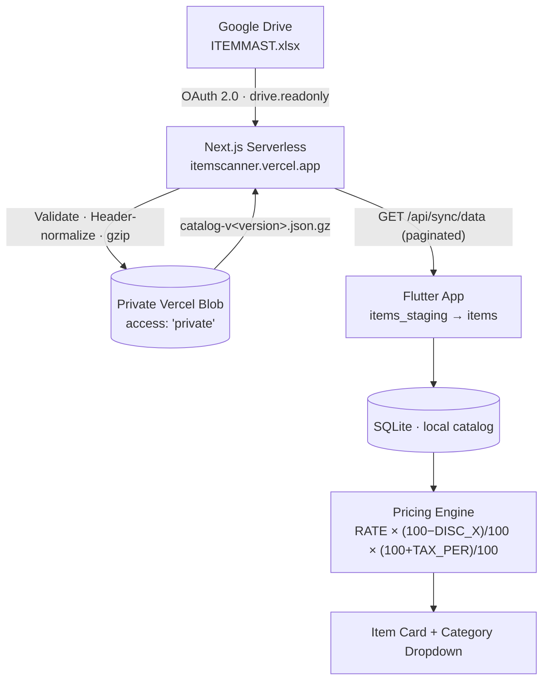

# Application Documentation: Item Scanner

**Repository:** `item_scanner` (`https://github.com/karamveersingh22/item-scanner`)
**Application Title:** Item Scanner (`ITEM MASTER`)
**Flutter Package:** `item_scanner`
**Android Application ID / Namespace:** `com.example.item_scanner`
**Production Backend URL:** `https://itemscanner.vercel.app`
**Documentation Revision:** 3.0 — supersedes revision 2.0
**Last Updated:** October 2026

> **This file is the single source of truth for this project.** Any AI agent or engineer
> must read this file before making changes. If code and this document disagree, the code is
> authoritative and this document must be corrected in the same change.

---

## Table of Contents

1. [Project Overview](#1-project-overview)
2. [Current Production Architecture & Data Flow](#2-current-production-architecture--data-flow)
3. [Business Logic](#3-business-logic)
4. [Pricing Engine & Customer Categories](#4-pricing-engine--customer-categories)
5. [Google Drive Integration](#5-google-drive-integration)
6. [Automatic File Discovery (No-Website Workflow)](#6-automatic-file-discovery-no-website-workflow)
7. [Synchronization Pipeline](#7-synchronization-pipeline)
8. [Mobile Offline-First Design](#8-mobile-offline-first-design)
9. [Authentication & Credential Management](#9-authentication--credential-management)
10. [Spreadsheet Contract](#10-spreadsheet-contract)
11. [Database Schema (SQLite v3)](#11-database-schema-sqlite-v3)
12. [API Reference](#12-api-reference)
13. [Deployment Procedures](#13-deployment-procedures)
14. [Build Environment & Toolchain](#14-build-environment--toolchain)
15. [Change Log — Revision 2.0 → 3.0](#15-change-log--revision-20--30)
16. [Bugs Found & Fixed During Revision 3.0](#16-bugs-found--fixed-during-revision-30)
17. [Testing & Verification](#17-testing--verification)
18. [Known Limitations](#18-known-limitations)
19. [Operational Runbook & Troubleshooting](#19-operational-runbook--troubleshooting)
20. [Critical Invariants for Future Agents](#20-critical-invariants-for-future-agents)

---

## 1. Project Overview

`item_scanner` is an offline-first inventory lookup application for retail, distribution and
warehouse environments. Staff scan or type an item code (`I_CODE`) and instantly receive item
name, description, quantity and a **final tax-inclusive price for the selected customer
category** — with zero network dependency after the first catalog sync.

### Core Capabilities
| Capability | Implementation |
| :--- | :--- |
| Offline lookup | Local SQLite with `idx_items_icode` B-Tree index |
| Camera scanning | Google ML Kit Text Recognition, 350 ms frame throttle |
| Multi-category pricing | 14 customer categories (`DISC_A` … `DISC_N`), selectable in-app |
| Tax-inclusive pricing | `TAX_PER` per item, applied on top of category discount |
| Cloud catalog | Next.js serverless on Vercel, private Vercel Blob storage |
| Data source | Google Drive `.xlsx` via OAuth 2.0 (`drive.readonly`) |
| Atomic updates | Staging table + single SQLite transaction swap |

### Identity Notes
* The Android application ID is still the upstream author's placeholder
  `com.example.item_scanner`. For a genuine client fork this **must** be changed to a
  reverse-domain identifier, otherwise it cannot coexist with the original app on a device.
* `README.md` and `PRODUCTION_HANDOVER.md` still reference the upstream deployment
  `https://item-scanner-beryl.vercel.app`. **Those references are stale.** The only live
  backend is `https://itemscanner.vercel.app`. Do not use the old URL anywhere.

---

## 2. Current Production Architecture & Data Flow


```mermaid
flowchart TD
    GDrive["Google Drive<br/>ITEMMAST.xlsx"] -->|"OAuth 2.0 · drive.readonly"| API["Next.js Serverless<br/>itemscanner.vercel.app"]
    API -->|"Validate · Header-normalize · gzip"| Blob[("Private Vercel Blob<br/>access: 'private'")]
    Blob -->|"catalog-v&lt;version&gt;.json.gz"| API
    API -->|"GET /api/sync/data (paginated)"| App["Flutter App<br/>items_staging → items"]
    App --> SQLite[("SQLite · local catalog")]
    SQLite --> Pricing["Pricing Engine<br/>RATE × (100−DISC_X)/100 × (100+TAX_PER)/100"]
    Pricing --> Card["Item Card + Category Dropdown"]
```

### Two-Phase Publication (server)

1. Client uploads/overwrites `ITEMMAST.xlsx` in Google Drive.
2. `POST /api/sync/trigger` acquires a per-company sync lock.
3. Backend resolves the target file (stored ID, else auto-discovery — see §6).
4. Optimisation: compares Drive `md5Checksum` with stored `google_drive_md5`. If equal and
   `item_count > 0`, returns `{ unchanged: true }` without downloading.
5. Downloads the `.xlsx` binary, streams it through the OpenXML parser (`adm-zip`).
6. Validates mandatory headers, rejects duplicate `I_CODE`, extracts `DISC_A`…`DISC_N` and
   `TAX_PER`.
7. Writes immutable gzip blob `catalog-v<data_version>.json.gz` (`access: 'private'`).
8. Verifies the blob is readable and the row count matches.
9. Atomically updates the config pointer (`active_catalog_version`, `data_version`,
   `item_count`, `google_drive_md5`), then deletes the superseded catalog blob.
10. Releases the sync lock.

### Two-Phase Publication (device)

1. App requests `GET /api/sync/data?version=<local_data_version>&limit=1000&offset=0`.
2. If `up_to_date: true`, the app records a check timestamp and stops.
3. Otherwise it clears `items_staging` and batch-inserts each 1000-row page.
4. Validates staged row count equals the server's `item_count`.
5. Executes a single SQLite transaction: `DELETE FROM items` → explicit-column
   `INSERT INTO items SELECT ... FROM items_staging` → `DELETE FROM items_staging`.
6. Persists `catalog_data_version` and `last_sync_time` **only after** commit.

---

## 3. Business Logic

### Intended day-to-day operation

```
[1] Staff member updates ITEMMAST.xlsx on a PC
        ↓
[2] Uploads/replaces the file in Google Drive   (no website involved)
        ↓
[3] Someone opens the app and taps [SYNC DATABASE]
        ↓
[4] App → POST /api/sync/trigger   (Drive → Blob, server-side)
        ↓
[5] App → GET  /api/sync/data     (Blob → device SQLite)
        ↓
[6] Every device that taps [SYNC DATABASE] now serves the new catalog
```

Phones that do not tap sync continue to serve their previously downloaded catalog. This is
intentional: the device catalog is an independent snapshot, not a live view.

### The admin website is a one-time bootstrap tool

`https://itemscanner.vercel.app/admin/*` is required **exactly once** to grant the backend
Google Drive access:

1. `Admin Portal → SIGN IN`
2. `CONNECT GOOGLE DRIVE` → authorise the Google account that owns the spreadsheet
3. `Select` the spreadsheet (writes `google_drive_file_id` into config)
4. Optional `Sync Now` to publish immediately

After that, ordinary data updates never require the website. The website remains useful for
credential rotation, connection health checks and disconnecting Drive.

---

## 4. Pricing Engine & Customer Categories

### Discount columns

The spreadsheet carries one discount percentage per customer category:

| Header | Meaning |
| :--- | :--- |
| `DISC_PER` | Legacy/base percentage column (retained, still required by the parser) |
| `DISC_A` … `DISC_N` | Per-category discount percentages (14 categories, a → n) |
| `TAX_PER` | Tax percentage applicable to the item |

Header matching is case-insensitive and tolerates separator variance: `DISC_A`, `DISC A`
and `DISCA` are all accepted (`backend/src/lib/excel-parser.ts`). Only `DISC_B` and
`TAX_PER` among the new columns are directly exercised by the default UI path; the rest are
stored and selectable.

### Formulas

```text
discounted_rate(c) = RATE × (100 − DISC_c) / 100
price_after_tax(c)  = discounted_rate(c) × (100 + TAX_PER) / 100
```

Implemented in `lib/services/database_service.dart`:

* `calculateDiscountedRate(rawRate, rawDisc)` (line ~136)
* `calculatePriceAfterTax(rawRate, rawDisc, rawTaxPer)` (line ~196)

Both:
* strip currency noise (`₹`, `Rs.`, `Rs`, `,`) and `%` from inputs;
* fall back to the raw `RATE` string if it cannot be parsed;
* format to two decimals and trim a trailing `.00`.

### Default and switching

* The default category is **`b`** (`lib/main.dart:134`).
* The item card renders a `DropdownButton` listing `a`–`n` (`lib/main.dart:141`, built at
  ~line 684). Selecting a category calls `setState` and immediately recomputes the displayed
  price — no database round-trip, because the whole row is already in memory.
* `_getDiscColumn(category)` (`lib/main.dart:267`) maps the selected letter to its column key
  (`a → DISC_A` … `n → DISC_N`), defaulting to `DISC_B`.
* The card shows **only** `price_after_tax`. The discounted rate is never displayed
  separately; it is an intermediate value.

---

## 5. Google Drive Integration

| Aspect | Detail |
| :--- | :--- |
| API | Google Drive API v3 via `google-auth-library` |
| Scopes | `drive.readonly`, `userinfo.email` |
| Permissions | Strictly read-only; the backend cannot modify client files |
| Token storage | AES-256-GCM ciphertext, format `iv:authTag:data` (hex), keyed by `ENCRYPTION_KEY` |
| CSRF protection | OAuth `state` = `base64url({company_id,timestamp,nonce}) + "." + HMAC-SHA256`, 15-minute expiry |
| File listing | `trashed = false and (mimeType = '...sheet' or name contains '.xlsx')`, `pageSize=50` |
| Folder support | **None.** There is no `'<folderId>' in parents` clause anywhere — any folder works |

### OAuth publishing status

The OAuth consent screen is published to **In production**. Because `drive.readonly` is a
sensitive scope, Google shows an *"Google hasn't verified this app"* interstitial. Authorisers
must click **Advanced → Go to itemscanner.vercel.app (unsafe)**. This is expected and does
not affect functionality. Publishing to production is what stops refresh tokens from expiring
every 7 days (the Testing-mode expiry).

---

## 6. Automatic File Discovery (No-Website Workflow)

**Problem solved:** previously the backend stored a single `google_drive_file_id`. If the
client deleted the old spreadsheet and uploaded a new one — even with an identical filename —
Drive assigns a **new file ID**. The backend kept requesting the deleted ID, so the app
silently kept serving the previous catalog and the only remedy was re-selecting the file in
the website.

**Solution:** `findTargetSpreadsheet()` (`backend/src/lib/google-drive.ts`) plus auto-detection
in `backend/src/app/api/sync/trigger/route.ts`:

1. Try the stored `google_drive_file_id` (cheap metadata probe).
2. If that probe fails (file deleted/replaced/moved), fall back to auto-discovery:
   * list all non-trashed `.xlsx` files;
   * prefer an exact, case-insensitive `itemmast.xlsx` match;
   * among matches, choose the most recently modified;
   * if no exact match and only one `.xlsx` exists, use it;
   * otherwise use the most recently modified `.xlsx`.
3. Persist the newly resolved ID/name into config so subsequent syncs are cheap.

`getDriveFileMetadata(company, fileId?)` and `downloadDriveFile(company, fileId?)` now accept
an optional ID override so the resolved file can be used without mutating stored state first.

### Operational rule for the client

Keep **one** `.xlsx` in the connected Drive account, and name it `ITEMMAST.xlsx`. Under that
constraint auto-discovery is deterministic. If several spreadsheets must coexist, name the
authoritative one `ITEMMAST.xlsx` — the newest such file wins.

---

## 7. Synchronization Pipeline

### Trigger paths

| Path | Endpoint | Purpose |
| :--- | :--- | :--- |
| Manual (app) | `POST /api/sync/trigger` then `GET /api/sync/data` | Full Drive → Blob → device |
| Automatic (app) | `GET /api/sync/data` only | Device refresh without re-reading Drive |
| Admin panel | `POST /api/sync/trigger` | Operator-triggered publish |

`lib/services/cloud_sync_service.dart:135` calls `_apiService.triggerSync(token: token)` when
`force: true` (i.e. the `[SYNC DATABASE]` button), so a single button performs Drive → Blob →
device. Automatic/foreground syncs use `force: false` and skip the Drive step.

### Concurrency, locking and retries

* A per-company sync lock prevents parallel publishes; a second concurrent caller receives
  `409`, which the app treats as "already running, continue to fetch".
* Transient failures (network errors, 5xx) retry with bounded exponential backoff of
  **2 s → 5 s → 15 s** (`retryDelays` in `CloudSyncService`).
* Permanent failures abort immediately with zero retries: `401`, `403`, duplicate `I_CODE`,
  spreadsheet validation errors.
* Minimum automatic re-check interval: **15 minutes** (`kDefaultMinimumSyncInterval`). Manual
  sync bypasses it.
* Automatic sync runs on app launch and on a 15-minute foreground timer. It deliberately does
  **not** run as a background daemon when the app is terminated.

### Versioning invariants

Two independent hashes, never conflated:

| Field | Computed over | Used by |
| :--- | :--- | :--- |
| `google_drive_md5` | Raw `.xlsx` bytes as reported by Drive | Backend change detection |
| `data_version` | `MD5(item_count + Σ(i_code¦rate¦quantity¦disc_per¦disc_b;)*)` | Device up-to-date check |

> **Known limitation:** `data_version` does not incorporate `DISC_A`…`DISC_N` or `TAX_PER`.
> A spreadsheet edit that changes *only* those columns, while leaving `RATE`, `QUANTITY`,
> `DISC_PER` and `DISC_B` untouched, yields an unchanged `data_version` and can be reported as
> `unchanged: true` — the device will not re-download. Changing any hashed field, or
> re-selecting the file in `/admin/drive`, forces republication. Extending the hash input to
> include the new columns is the recommended follow-up (§18).

---

## 8. Mobile Offline-First Design

* **Zero-network lookup.** `DatabaseService.findItem()` queries local SQLite only. Barcode
  scan, manual entry and detail rendering never make network calls.
* **Startup.** Local SQLite initialises before any remote call; the UI is usable immediately.
* **Atomic integrity.** A failed or interrupted sync wipes `items_staging` and leaves the
  active `items` catalog fully intact and searchable.
* **Session resilience.** `AuthService.restoreSession()` catches network failures and falls
  back to the cached company profile, so an offline launch still works.
* **Camera privacy.** ML Kit processes frames on-device; no images are written to disk or
  transmitted.

### Camera OCR

* Engine: `google_mlkit_text_recognition: 0.17.1` with `camera: ^0.12.0+2`.
* Live `ImageFormatGroup.nv21` frames sampled every **350 ms** to limit CPU/battery drain.
* Extraction regex: `(?:I|1)\s*[._]?\s*CODE\s*[:\-]?\s*([0-9]{3,})` — tolerates OCR confusion
  of `I`↔`1`, label variants (`I.CODE: 40515`, `1-CODE 1234`, `ICODE: 99999`), minimum 3 digits.
* On match, streaming stops immediately and the code is resolved via `findItem()`.

---

## 9. Authentication & Credential Management

### Token issuance
JWT signed HS256, 7-day expiry, secret from `JWT_SECRET` (minimum 32 chars). Mobile tokens are
persisted in `FlutterSecureStorage`; the admin panel additionally receives an `httpOnly`,
`sameSite=lax`, `secure`-in-production `session` cookie.

`authenticateRequest()` accepts the token from `Authorization: Bearer …` **or** the `session`
cookie, re-validates the company record on every request, and rejects `DISABLED` accounts with
`403`. Company identity is derived solely from the verified JWT; client-supplied company IDs
are ignored.

### Credential precedence (changed in revision 3.0)

`backend/src/lib/db.ts` now resolves the admin password in this order:

1. `ADMIN_PASSWORD_HASH` — valid bcrypt (`$2a$`/`$2b$`/`$2y$` + cost + 53 base64 chars).
2. `ADMIN_PASSWORD` — **plain text, hashed with bcrypt (cost 12) at startup.** New in
   revision 3.0 so a client-requested password can be applied by editing one Vercel variable
   instead of generating a hash locally.
3. Fallback constant in `db.ts:31` — bcrypt of `admin123!`.

The stored value is always a bcrypt hash; plaintext is never persisted.

### Applying a credential change — the mandatory extra step

Company configuration lives in private Vercel Blob (`company-config.json`), **not** in the
function's environment. Editing a Vercel env var therefore does **not** by itself change the
live password. You must also bump the version tag:

```text
ADMIN_USERNAME=clientname
ADMIN_PASSWORD=NewClientPassword123
ADMIN_CREDENTIALS_VERSION=v2      # v1 → v2 → v3 … one bump per change
```

`getCompany()` only re-applies credentials when `ADMIN_CREDENTIALS_VERSION` differs from the
persisted `admin_credentials_version`. If the version is not bumped, the old password silently
remains in effect — this is the single most common cause of "my Vercel password change did
nothing".

After changing variables, trigger a Vercel redeploy (Clear Build Cache) — Vercel does not
apply env changes to already-running deployments.

**Alternative:** change credentials through `/admin/credentials` in the panel; it writes
directly to storage and needs no redeploy or version bump.

### Quote handling caveat
`normalizeBcryptHash()` strips only *matching* surrounding quotes. In the Vercel dashboard,
enter values **without** surrounding quotes, otherwise a literal `"` becomes part of the
username or password.

---

## 10. Spreadsheet Contract

### Mandatory columns
`I_CODE`, `ITEM_NAME`, `DESCRIBE`, `QUANTITY`, `RATE`, `DISC_PER`, `DISC_B`

### Optional columns
`TAX_PER`, `DISC_A`, `DISC_C`, `DISC_D`, `DISC_E`, `DISC_F`, `DISC_G`, `DISC_H`, `DISC_I`,
`DISC_J`, `DISC_K`, `DISC_L`, `DISC_M`, `DISC_N`

Missing any mandatory column aborts the sync with `400 ExcelValidationError` and the previous
catalog stays active.

### Rules
* **Only the first worksheet** is parsed (`xl/worksheets/sheet1.xml`, falling back to the first
  available worksheet XML).
* **`I_CODE` must be unique.** Any duplicate aborts the whole sync, reporting a sample of the
  offending codes.
* **`I_CODE` is treated as a string** and leading zeros are preserved (`001234` stays
  `001234`).
* Rows with an empty `I_CODE` are skipped silently.
* **File must be `.xlsx`** (OpenXML). Legacy `.xls` is not supported by the parser; the
  `select` endpoint also rejects non-`.xlsx` names.
* Only the **first row** is treated as the header row.
* Empty cells are stored as `null`; the pricing engine treats `null`/unparsable discounts and
  tax as `0`.

---

## 11. Database Schema (SQLite v3)

`lib/services/database_service.dart` — file `item_scanner.db`, `version: 3`, tables `items`
and `items_staging` with identical column sets:

```sql
I_CODE      TEXT PRIMARY KEY
ITEM_NAME   TEXT
DESCRIBE    TEXT
QUANTITY    TEXT
RATE        TEXT
DISC_PER    TEXT
DISC_A..DISC_N TEXT
TAX_PER     TEXT
```

Plus `CREATE INDEX IF NOT EXISTS idx_items_icode ON items (I_CODE)`.

### Schema self-healing
Because devices upgrade across APKs with differing schema versions, `_openDatabase()` runs a
defensive repair on **every** open:

1. `ALTER TABLE … ADD COLUMN` for all 15 discount/tax columns on **both** `items` and
   `items_staging` (previously it repaired only `items`, which is what broke staging — see
   §16).
2. `CREATE TABLE IF NOT EXISTS items_staging`.
3. If `PRAGMA table_info(items_staging)` still lacks `TAX_PER` after the ALTER attempts — a
   legacy table shape that cannot be extended — `items_staging` is dropped and recreated.
   This is safe: staging is transient by definition and the active `items` catalog is never
   dropped.

`onUpgrade` performs the same ALTERs when the version number increases.

### Atomic publish
`atomicallyPublishStaging()` (line ~300) names all 21 columns explicitly on both sides of the
copy instead of `SELECT *`. This removes any dependence on physical column ordering, which can
diverge between a migrated `items` table and a freshly created `items_staging` table.

---

## 12. API Reference

| Route | Method | Auth | Description |
| :--- | :--- | :--- | :--- |
| `/api/auth/login` | POST | Public | Validates credentials, returns JWT, sets session cookie |
| `/api/auth/logout` | POST | Public | Clears session cookie |
| `/api/auth/me` | GET | Bearer | Current company profile (secrets stripped) |
| `/api/company/profile` | GET, PUT | Bearer | Read/update display name |
| `/api/company/credentials` | PUT | Bearer | Change username/password (verifies current) |
| `/api/google-drive/auth-url` | GET | Bearer | Signed OAuth authorisation URL |
| `/api/google-drive/callback` | GET | Public | OAuth callback; encrypts refresh token |
| `/api/google-drive/status` | GET | Bearer | Connection state + selected file |
| `/api/google-drive/files` | GET | Bearer | Lists accessible `.xlsx` files |
| `/api/google-drive/select` | POST | Bearer | Persists selected file ID/name |
| `/api/google-drive/disconnect` | POST | Bearer | Revokes local link; never deletes Drive files |
| `/api/google-drive/test` | GET | Bearer | Token refresh health check |
| `/api/sync/trigger` | POST | Bearer | Drive → Blob publish (auto-detects file) |
| `/api/sync/status` | GET | Bearer | Sync status, counts, versions |
| `/api/sync/data` | GET | Bearer | Paginated catalog (`limit`, `offset`, `version`) |

Public pages: `/`, `/privacy`, `/admin/login`, `/admin`, `/admin/drive`, `/admin/sync`,
`/admin/profile`, `/admin/credentials`.

### Notable responses
* `POST /api/sync/trigger` → `{ success, data: { message, item_count, data_version, duration_ms } }`
  or `{ unchanged: true }` when the Drive MD5 is unchanged.
* `409` — a sync is already running.
* `400` — Drive not connected, no spreadsheet found, or spreadsheet validation failure.
* `401` — missing/expired JWT, **or** Google Drive authorisation expired
  (`invalid_grant`); the Drive case is explicitly mapped to a human-readable message.

---

## 13. Deployment Procedures

### Backend — changes under `backend/`
```bash
cd backend
npm run build     # must compile 26 routes with zero TypeScript errors
git add .
git commit -m "describe change"
git push          # Vercel auto-deploys from main
```
Verify the deployment banner in the Vercel dashboard before testing. Note that adding or
changing environment variables requires a redeploy with **Clear Build Cache**.

### Mobile — any change under `lib/`, `android/`, `pubspec.yaml`
```bash
flutter pub get
flutter analyze                      # must report "No issues found!"
flutter build apk --release --dart-define=BACKEND_BASE_URL=https://itemscanner.vercel.app
```
Artifact: `build/app/outputs/flutter-apk/app-release.apk` (~93 MB).
Distribute manually to each device — there is no store or auto-update channel.

### Decision rule
| Changed | Redeploy backend? | New APK? |
| :--- | :--- | :--- |
| `backend/**` only | Yes | No |
| `lib/**`, `android/**` only | No | **Yes** |
| Excel contents only | No (data, not code) | No — just re-sync on devices |

Backend base URL resolution order (`lib/services/api_service.dart`):
1. Runtime override typed on the login screen (`api_base_url_custom` in SharedPreferences)
2. Compile-time `--dart-define=BACKEND_BASE_URL=…`
3. Compiled-in production default `https://itemscanner.vercel.app`

---

## 14. Build Environment & Toolchain

| Component | Version / Location |
| :--- | :--- |
| Flutter | **3.47.4**, installed at `C:\flutter` (short path — mandatory on Windows) |
| Dart SDK | `^3.12.2` (enforced by `pubspec.yaml`) |
| Java | **21** (`JAVA_HOME`) — Microsoft OpenJDK 21 accepted |
| Android SDK | compileSdk 37, targetSdk 36, minSdk 21, Build-Tools 36 |
| Android Gradle Plugin | 9.0.1 |
| Gradle | 9.1.0 |
| Kotlin | 2.3.20 (JVM target 17) |
| Node.js | v20 LTS or newer |

### Why Java is required
Flutter/Dart compiles to native ARM code; **Gradle (a JVM tool) performs Android packaging** —
compilation, resource merging, signing and zipalign. `flutter_secure_storage: ^11.0.0`
requires `compileSdk = 37`, which requires AGP 9.0.1, which requires Java 21. There is no
Java-free path to an Android APK.

### Windows-specific hard-won knowledge
1. **Install Flutter to `C:\flutter`.** Deep paths (e.g. inside `Downloads` under a long user
   or project folder) cause `error: unable to create file … Filename too long` and
   `fatal: Could not reset index file` during `flutter upgrade`. Install to the short path.
2. **Adding `C:\flutter\bin` to PATH is not enough** — every already-open terminal and IDE
   keeps the old resolution. Close and reopen all of them, then confirm with
   `where.exe flutter` and `flutter --version`.
3. **Android SDK platform naming.** The SDK Manager may install `android-37.0` while AGP
   demands hash string `android-37`. If `Failed to find target with hash string 'android-37'`
   appears, copy the directory:
   ```powershell
   Copy-Item -LiteralPath "$env:LOCALAPPDATA\Android\Sdk\platforms\android-37.0" `
             -Destination "$env:LOCALAPPDATA\Android\Sdk\platforms\android-37" -Recurse -Force
   ```
   The resulting "inconsistent location" warnings are cosmetic.
4. **Network-restricted environments** may block `services.gradle.org` (Gradle distribution
   download) and `dl.google.com` (SDK/NDK). Either retry, switch to a mobile hotspot, or
   pre-download the Gradle zip into
   `%USERPROFILE%\.gradle\wrapper\dists\gradle-9.1.0-all\<hash>\`.

### Gradle tuning already applied (`android/gradle.properties`)
```properties
org.gradle.jvmargs=-Xmx4096m -XX:MaxMetaspaceSize=1024m -XX:ReservedCodeCacheSize=512m
org.gradle.parallel=false
org.gradle.workers.max=1
kotlin.daemon.jvmargs=-Xmx1024m
android.suppressUnsupportedCompileSdk=37.0
```
`android/app/build.gradle.kts` also sets `lint { checkReleaseBuilds = false }`.

Both were required: release lint runs UAST analysis over plugin sources
(`flutter_secure_storage`, `camera_android_camerax`) and exhausted Metaspace on a
memory-constrained workstation, failing the build with
`OutOfMemoryError: ClassLoader.defineClass1`.

---

## 15. Change Log — Revision 2.0 → 3.0

### C1 — Plain-text admin password from environment
* **Files:** `backend/src/lib/db.ts` (added `bcryptjs` import; hash-or-plain resolution in
  both the "stored config exists" and "first-run seed" paths), `backend/.env.example`.
* **Why:** the client had not yet chosen credentials; regenerating a bcrypt hash locally for
  every change was slow and error-prone.
* **Behaviour:** `ADMIN_PASSWORD` is hashed at startup. `ADMIN_PASSWORD_HASH` still takes
  priority when it contains a valid bcrypt hash.

### C2 — One-click Drive → Blob → device sync
* **Files:** `lib/services/api_service.dart` (new `triggerSync()` posting to
  `/api/sync/trigger`), `lib/services/cloud_sync_service.dart` (calls it when `force: true`).
* **Why:** the client should never need the website after day one.
* **Behaviour:** `[SYNC DATABASE]` now performs the complete chain. Automatic/foreground syncs
  still skip the Drive step.

### C3 — Automatic spreadsheet discovery
* **Files:** `backend/src/lib/google-drive.ts` (new `findTargetSpreadsheet()`; optional
  `fileId` override on `getDriveFileMetadata()` and `downloadDriveFile()`),
  `backend/src/app/api/sync/trigger/route.ts` (fallback resolution + persistence).
* **Why:** deleting and re-uploading the spreadsheet produced a new Drive file ID, so the
  stored ID went stale and the app kept serving deleted data.
* **Behaviour:** see §6.

### C4 — Richer sync-trigger diagnostics
* **File:** `backend/src/app/api/sync/trigger/route.ts`.
* **Why:** generic 500s and Flutter's 2/5/15 s retry loop produced a ~5-minute silent hang with
  no actionable message.
* **Behaviour:** auto-detection failures, auth failures (`invalid_grant`, 401/403), Drive
  download failures and parser failures are each logged and mapped to specific messages;
  `invalid_grant` returns `401` with "Google Drive authorization expired. Please reconnect
  Drive in the admin panel."

### C5 — Customer categories and tax-inclusive pricing
* **Files:** `backend/src/lib/excel-parser.ts` (parse `DISC_A`…`DISC_N` + `TAX_PER`),
  `lib/models/sync_item.dart` (new fields + `getDiscForCategory()`),
  `lib/services/database_service.dart` (schema v3, `calculatePriceAfterTax()`),
  `lib/main.dart` (category dropdown, price-after-tax display, `_getDiscColumn()`).
* **Behaviour:** see §4.

### C6 — Build environment repairs
* **Files:** `android/gradle.properties`, `android/app/build.gradle.kts`.
* **Behaviour:** see §14.

### C7 — Sync integrity fixes
* **Files:** `lib/services/cloud_sync_service.dart`, `lib/services/database_service.dart`.
* **Behaviour:** see §16.

---

## 16. Bugs Found & Fixed During Revision 3.0

### B1 — Silent staging-insert failure (highest impact)
**Symptom:** `Sync failed: Staging validation mismatch: expected 4222 records but found 0 in
staging table`, appearing only after upgrading to the schema-v3 APK.

**Two compounding causes:**

1. **Unawaited insert.** `validateAndStage()` was declared `void` and called
   `_dbService.insertStagingBatch(rows)` without `await`. The returned `Future` was
   fire-and-forget, so any insert exception became an unhandled async error and was swallowed.
   `items_staging` stayed empty and the next validation read 0 rows.
2. **Staging table never migrated.** The schema version constant was left at `2` while the
   migration guard tested `oldVersion < 3`, so `onUpgrade` never ran. The defensive repair loop
   that does run on every open only patched the `items` table, leaving a legacy
   `items_staging` without `DISC_A`…`DISC_N`/`TAX_PER`. Every staging insert therefore failed
   with *"no such column"*. Larger rows (21 columns vs 7) also made the original race far more
   likely to lose.

**Fixes:** `validateAndStage()` is now `Future<void>` and both call sites `await` it; the schema
version is `3`; the defensive repair loop covers **both** tables and self-heals by recreating
`items_staging` when it cannot be extended.

### B2 — Column-order-dependent catalog swap
`INSERT INTO items SELECT * FROM items_staging` assumed identical physical column ordering.
Migrated and freshly-created tables can diverge. The swap now names all 21 columns explicitly
on both sides.

### B3 — Duplicate literal in `DISC_N` header matching
The header test read `name === 'DISC_N' || name === 'DISC N' || name === 'DISC N'`, so the
`DISCN` variant was never recognised and that column silently resolved to `null`. Corrected to
`'DISCN'`.

### B4 — Quoted Vercel env values became part of credentials
Values entered as `ADMIN_USERNAME="admin"` store the quote characters. `normalizeBcryptHash()`
strips quotes from hashes but no equivalent normalisation exists for usernames or plain
passwords. Guidance: never include quotes in Vercel variable values.

---

## 17. Testing & Verification

### Static and automated
```bash
flutter analyze     # expect: No issues found!
flutter test        # 30 tests: models, auth, sync, atomicity, 10k/50k/100k benchmarks
cd backend
npm run build       # 26 routes, zero TypeScript errors
npm test            # 82+ assertions across 6 scripts
```

### Manual end-to-end (the definitive check)
1. **Bootstrap once:** admin panel → connect Drive → select `ITEMMAST.xlsx` → Sync Now.
2. **Upgrade path:** install the new APK **over** the old one (do not uninstall) → Sync →
   catalog count must match the spreadsheet row count. This exercises the v2 → v3 migration.
3. **Fresh install:** uninstall → install → login → Sync → same expected count.
4. **Daily flow, no website:** edit the spreadsheet locally → upload/replace in Drive → on the
   phone tap `SYNC DATABASE` → expected value visible. Confirm on a second device that did
   *not* sync that it still shows the previous value.
5. **Auto-discovery:** delete the Drive spreadsheet, upload a new one, tap `SYNC DATABASE` →
   new data must appear without visiting the website.
6. **Pricing:** open an item → confirm default `Category B`; switch through several categories
   and verify against hand-computed
   `RATE × (100 − DISC_X)/100 × (100 + TAX_PER)/100`.
7. **Offline:** enable airplane mode → search and scan must still work; relaunch offline must
   reach the home screen using the cached profile.
8. **Atomicity:** put a duplicate `I_CODE` in the spreadsheet → Sync → expect a `400` naming
   the duplicate and confirmation that the previously cached catalog is still fully searchable.

---

## 18. Known Limitations

| Item | Status | Impact / recommendation |
| :--- | :--- | :--- |
| `data_version` excludes `DISC_A`…`DISC_N`, `TAX_PER` | Open | Edits touching only these columns may be reported `unchanged`. Extend the hash input in `excel-parser.ts` to include them. |
| 1D barcode decoding | Not implemented | OCR text recognition only |
| Multi-column full-text search (FTS5) | Not implemented | Exact `I_CODE` lookup only |
| Background sync when app terminated | Intentional | Sync on launch and every 15 min in foreground |
| Multi-company support | Removed | Single-company architecture |
| `.xls` (legacy binary) | Unsupported | `.xlsx` only |
| Release signing uses the debug key | Open | Fine for sideloading; a real keystore plus `flutter build appbundle --release` is required for Play Store |
| Application ID still `com.example.item_scanner` | Open | Change for a genuine client fork |
| OAuth app unverified | Accepted | "Advanced → (unsafe)" click-through required |
| In-memory sync lock | Open | Per-instance only; not a distributed lock. Concurrent publishes from separate warm instances are possible. |

---

## 19. Operational Runbook & Troubleshooting

### App shows "authentication expired" or sync fails with `401`
Distinguish the two `401`s:
* *Session* `401` → the app JWT expired (7 days). Re-login.
* *"Google Drive authorization expired"* → the Drive refresh token is invalid (`invalid_grant`).
  Reconnect: admin panel → Disconnect → Connect Google Drive → click Advanced on the
  unverified-app screen → select the file → Sync Now.

### Sync fails with `400` "Missing required columns"
The spreadsheet header row must contain all seven mandatory columns exactly
(see §10). Parser diagnostics are case-insensitive but the names themselves are fixed.

### Sync fails with duplicate `I_CODE`
The error names sample offending codes. Remove or rename duplicates in the spreadsheet. The
previously published catalog remains active — no data loss.

### App hangs on "syncing"
Almost always a `5xx` being retried with 2 s / 5 s / 15 s backoff. Check Vercel function logs;
newer builds return specific messages instead of bare `500`.

### `Failed to find target with hash string 'android-37'`
SDK Manager installed `android-37.0` but AGP requires `android-37`. Copy the directory
(§14, item 3).

### `JAVA_HOME is set to an invalid directory`
Point `JAVA_HOME` at a real JDK 21 root (the folder that contains `bin\java.exe`), then open a
new terminal.

### `Filename too long` / `Could not reset index file` during `flutter upgrade`
Flutter lives at a path too long for Windows git. Reinstall to `C:\flutter`.

### Vercel env change has no effect
Redeploy with Clear Build Cache, and — for credential changes — also bump
`ADMIN_CREDENTIALS_VERSION`.

### Excel edited in Google Sheets but data did not change
Drive serves the stored `.xlsx` binary. Download it, confirm the edit persisted, then re-upload
choosing **Replace existing**.

---

## 20. Critical Invariants for Future Agents

1. **Never persist a plaintext password.** `ADMIN_PASSWORD` is hashed at startup; storage only
   ever holds bcrypt.
2. **Never drop the sync lock on failure paths.** `publishCompanyItems()` and
   `recordSyncFailure()` both clear `activeSyncLockTime`; omitting this wedges sync for ten
   minutes.
3. **Atomicity is non-negotiable.** The active catalog is replaced only inside one SQLite
   transaction, only after the staged row count is verified. Never "optimise" this into
   multiple statements.
4. **Never `await`-drop a Future.** That exact mistake produced B1 and an empty catalog.
5. **Both catalog tables must stay schema-identical.** Any new column must be added to
   `items`, `items_staging`, `SyncItem.toMap()`, `SyncItem.fromJson()`, the Excel parser, and
   the explicit column list in `atomicallyPublishStaging()`.
6. **Search must remain network-free.** No lookup path may call the backend.
7. **Keep `google_drive_md5` and `data_version` distinct.** They answer different questions.
8. **Drive access is read-only.** Never widen scopes or add write operations.
9. **Preserve `I_CODE` as a string.** Leading zeros are meaningful.
10. **Duplicate `I_CODE` must abort the entire sync**, never silently de-duplicate.
11. **Do not rely on a Drive folder.** No folder scoping exists anywhere in the codebase.
12. **Bump `ADMIN_CREDENTIALS_VERSION` on every credential change**, or the change is ignored.
13. **Update this document in the same commit as any behavioural change.**

---

*End of document. Maintained as the authoritative reference for `item_scanner`.*