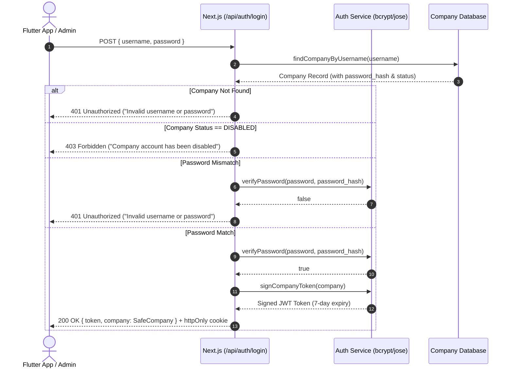

# Item Scanner Multi-Company Serverless Backend

Serverless Next.js (App Router) backend providing multi-company isolation, secure credential management, authentication, and synchronization endpoints for the Flutter Item Scanner application.

---

## 1. Project Structure

```
backend/
├── prisma/
│   └── schema.prisma         # Multi-company PostgreSQL schema
├── scripts/
│   └── test-stage2.ts        # Automated verification test suite (13 test cases)
├── src/
│   ├── app/
│   │   ├── api/
│   │   │   ├── admin/
│   │   │   │   └── company-status/route.ts  # PUT: Toggle ACTIVE / DISABLED
│   │   │   ├── auth/
│   │   │   │   ├── login/route.ts           # POST: Company authentication
│   │   │   │   ├── logout/route.ts          # POST: Clear session cookie
│   │   │   │   └── me/route.ts              # GET: Current session info
│   │   │   ├── company/
│   │   │   │   ├── credentials/route.ts     # PUT: Update username / password
│   │   │   │   ├── profile/route.ts         # GET/PUT: Company profile
│   │   │   │   └── register/route.ts        # POST: Company provisioning
│   │   │   ├── google-drive/
│   │   │   │   └── status/route.ts          # GET: Drive connection status placeholder
│   │   │   └── sync/
│   │   │       └── status/route.ts          # GET: Data sync status placeholder
│   │   ├── globals.css
│   │   ├── layout.tsx
│   │   └── page.tsx
│   └── lib/
│       ├── auth.ts           # Bcrypt password hashing & Jose JWT verification
│       ├── db.ts             # Database repository with company isolation
│       ├── response.ts       # Standardized API response wrappers
│       └── types.ts          # TypeScript domain interfaces
├── .env.example              # Environment variables template
├── package.json
└── tsconfig.json
```

---

## 2. Database Schema

The database is defined in [`prisma/schema.prisma`](file:///d:/raman%20software/item_scanner/backend/prisma/schema.prisma) and optimized for serverless PostgreSQL (e.g. Neon, Supabase, Vercel Postgres).

### Companies Table (`companies`)
| Field | Type | Description |
| :--- | :--- | :--- |
| `id` | UUID (PK) | Unique internal company identifier (`company_id`) |
| `company_name` | String | Organization display name |
| `username` | String (Unique) | Shared login username (e.g., `ABC001`) |
| `password_hash` | String | Salted bcrypt password hash (work factor 12) |
| `status` | Enum (`ACTIVE`, `DISABLED`) | Account access state |
| `google_drive_folder_id` | String (nullable) | Selected Google Drive folder ID |
| `google_drive_file_id` | String (nullable) | Selected `itemmast.xlsx` Drive file ID |
| `google_drive_file_name` | String (nullable) | Original filename in Drive |
| `google_refresh_token` | String (nullable) | Encrypted OAuth refresh token |
| `last_sync_at` | DateTime (nullable) | Last successful sync timestamp |
| `sync_status` | Enum (`IDLE`, `IN_PROGRESS`, `SUCCESS`, `FAILED`) | Current sync state |
| `sync_error` | String (nullable) | Details of sync error, if any |
| `data_version` | String (nullable) | Content hash / version tag |
| `item_count` | Int | Total indexed item records |
| `created_at`, `updated_at` | DateTime | Timestamps |

### Company Items Table (`company_items`)
Stores synced catalog rows isolated strictly by `company_id`.
* Composite index: `(company_id, i_code)`
* Constraint: Unique per company `(company_id, i_code)`

### Future Extensibility
* `employees`: Future employee login accounts (`company_id`, `username`, `name`, `password_hash`, `role`).
* `audit_logs`: Future action logs (`company_id`, `actor`, `action`, `details`, `ip_address`).

---

## 3. Environment Variables

Template file: `.env.example`

| Variable | Description |
| :--- | :--- |
| `DATABASE_URL` | Serverless PostgreSQL connection string (with SSL mode) |
| `JWT_SECRET` | Cryptographic secret for signing JWT session tokens (min. 32 chars) |
| `NODE_ENV` | `development` or `production` |
| `GOOGLE_CLIENT_ID` | Google Cloud OAuth 2.0 Client ID (Stage 5) |
| `GOOGLE_CLIENT_SECRET` | Google Cloud OAuth 2.0 Client Secret (Stage 5) |
| `GOOGLE_REDIRECT_URI` | Callback URL for Google OAuth handshake (Stage 5) |
| `ENCRYPTION_KEY` | 32-byte hex key for encrypting Google refresh tokens at rest |

---

## 4. Authentication Flow



---

## 5. Company Isolation Invariants

1. **Token-Derived Identity**: The backend **never** trusts client-supplied `company_id` parameters in headers or request bodies. The company identity is strictly parsed from the cryptographically signed JWT.
2. **Database Scoping**: Every database lookup for data or items is indexed and scoped to `company_id`.
3. **Cross-Company Access Prevention**: Company A's authenticated session cannot view, modify, or sync Company B's data under any circumstances.
4. **Active Revocation**: Protected endpoints re-check the company's status in the database on every request. If a company is set to `DISABLED`, active tokens are rejected immediately with `403 Forbidden`.

---

## 6. API Endpoints

### Authentication
* **`POST /api/auth/login`**:
  * Body: `{ "username": "ABC001", "password": "companyPassword" }`
  * Response: `{ "success": true, "data": { "token": "...", "company": { ... } } }`
* **`GET /api/auth/me`**:
  * Headers: `Authorization: Bearer <token>`
  * Response: `{ "success": true, "data": { "company": { ... } } }`
* **`POST /api/auth/logout`**:
  * Clears session cookies.

### Company Management
* **`POST /api/company/register`**:
  * Body: `{ "company_name": "ABC Traders", "username": "ABC001", "password": "password123" }`
  * Provisions a new company with salted bcrypt password hashing.
* **`GET /api/company/profile`**:
  * Returns authenticated company profile (sensitive fields omitted).
* **`PUT /api/company/profile`**:
  * Body: `{ "company_name": "New Company Name" }`
* **`PUT /api/company/credentials`**:
  * Body: `{ "current_password": "oldPassword", "new_username": "NEW001", "new_password": "newPassword" }`
  * Verifies `current_password`, updates username/password hash, and returns a fresh JWT token.

### Google Drive Integration (Stage 5)
* **`GET /api/google-drive/auth-url`**:
  * Generates Google OAuth authorization URL with cryptographic HMAC-signed state parameter binding flow to authenticated company.
* **`GET /api/google-drive/callback`**:
  * Handles OAuth redirect, validates state signature and freshness (< 15 min), exchanges authorization code for tokens, encrypts refresh token with AES-256-GCM, and commits to database.
* **`GET /api/google-drive/status`**:
  * Returns connection status, selected file ID, and filename. (Tokens are strictly omitted).
### Google Drive Integration (Stage 5)
* **`GET /api/google-drive/auth-url`**:
  * Generates Google OAuth authorization URL with cryptographic HMAC-signed state parameter binding flow to authenticated company.
* **`GET /api/google-drive/callback`**:
  * Handles OAuth redirect, validates state signature and freshness (< 15 min), exchanges authorization code for tokens, encrypts refresh token with AES-256-GCM, and commits to database.
* **`GET /api/google-drive/status`**:
  * Returns connection status, selected file ID, and filename. (Tokens are strictly omitted).
* **`GET /api/google-drive/files`**:
  * Lists accessible `.xlsx` spreadsheet files from authorized company Google Drive.
* **`POST /api/google-drive/select`**:
  * Associates selected `.xlsx` file ID and filename with the authenticated company record.
* **`POST /api/google-drive/disconnect`**:
  * Safely unlinks Google Drive by clearing encrypted tokens and file IDs from database. Does NOT delete files in Google Drive.
* **`GET /api/google-drive/test`**:
  * Verifies stored authorization health and tests token refresh validity.

### Catalog Data Synchronization (Stage 6)
* **`POST /api/sync/trigger`**:
  * Triggers server-side synchronization of company's selected `itemmast.xlsx`.
  * Enforces **Concurrent Sync Protection**: returns 409 Conflict if another sync is already in progress for this company.
  * Implements **No-Change Optimization**: checks Drive file checksum; skips reprocessing if unchanged.
  * Downloads, validates, and normalizes rows into memory.
  * Implements **True Atomic Publishing**: only updates active catalog, `data_version`, and `item_count` once validation passes completely. If anything fails, the previous catalog remains 100% intact.
* **`GET /api/sync/status`**:
  * Returns current sync metrics: `sync_status` (`IDLE`, `IN_PROGRESS`, `SUCCESS`, `FAILED`), `item_count`, `data_version`, `last_sync_at`, `file_name`, and safe `sync_error`.
* **`GET /api/sync/data`**:
  * Protected endpoint prepared for future Stage 7 Flutter synchronization.
  * Supports version checks (`?version=xxx`): returns `up_to_date: true` without payload if client has current version.
  * Supports pagination (`?limit=1000&offset=0`).

---

## 7. Synchronization & Ingestion Architecture

```text
Google Drive (Private Company Drive)
       ↓
Server-Side Download (OAuth token decrypted in server memory)
       ↓
Fast Streaming XLSX Parser (adm-zip + row regex extraction)
       ↓
Integrity & Normalization:
  • Mandatory Columns: I_CODE, ITEM_NAME, DESCRIBE, QUANTITY, RATE, DISC_PER, DISC_B
  • Leading Zeros Preserved: '001234' remains a string (never coerced to int/float)
  • Duplicate Detection: Rejects catalog if duplicate I_CODEs exist
       ↓
Atomic Transaction Commit:
  • Catalog items committed to company_items scoped by company_id
  • Deterministic MD5 data_version checksum generated
  • Companies metadata updated: item_count, data_version, last_sync_at, status='SUCCESS'
       ↓
Failure Safety Guarantee:
  • If download, parsing, or validation fails at any point,
    the PREVIOUS successful catalog remains 100% active and untouched.
```

---

## 8. Google Cloud & OAuth 2.0 Setup Guide

To connect live Google Drive accounts in production or staging, follow these steps in Google Cloud Console:

1. **Create or Select Google Cloud Project**:
   * Visit [Google Cloud Console](https://console.cloud.google.com/).
   * Create a new project named `Item Scanner Multi-Company` (or select existing).
2. **Enable Google Drive API**:
   * Navigate to **APIs & Services** > **Library**.
   * Search for **Google Drive API** and click **Enable**.
3. **Configure OAuth Consent Screen**:
   * Navigate to **APIs & Services** > **OAuth consent screen**.
   * Select User Type: **External** (for multi-company usage).
   * App name: `Item Scanner Management Panel`.
   * User support email: Enter admin email.
   * Scopes: Add narrowest required scopes:
     * `https://www.googleapis.com/auth/drive.readonly` (read metadata and spreadsheet contents only)
     * `https://www.googleapis.com/auth/userinfo.email` (read authorized account email)
   * If in Testing status: Add company test user Google Accounts to the test users list.
4. **Create OAuth 2.0 Client Credentials**:
   * Navigate to **APIs & Services** > **Credentials** > **Create Credentials** > **OAuth client ID**.
   * Application type: **Web application**.
   * Name: `Item Scanner Next.js Backend`.
   * **Authorized redirect URIs**:
     * Development: `http://localhost:3000/api/google-drive/callback`
     * Production: `https://your-backend-domain.com/api/google-drive/callback`
5. **Set Environment Variables**:
   * Copy Client ID and Client Secret into your server environment (`.env.local` or host dashboard):
     ```env
     GOOGLE_CLIENT_ID="<your-client-id>.apps.googleusercontent.com"
     GOOGLE_CLIENT_SECRET="<your-client-secret>"
     GOOGLE_REDIRECT_URI="https://your-backend-domain.com/api/google-drive/callback"
     ENCRYPTION_KEY="<32-byte-hex-key>"
     ```
   * *Note: If `GOOGLE_CLIENT_ID` is unset, backend automatically operates in safe Mock/Test mode for development and CI testing.*

---

## 9. Security & Token Encryption Architecture

1. **Zero Client Exposure**:
   * Google refresh tokens are **never** transmitted to the browser, mobile app, or URL parameters.
2. **AES-256-GCM Encryption at Rest**:
   * Sensitive tokens are encrypted before database insertion using 256-bit AES-GCM with a random 12-byte IV and authentication tag (`iv:authTag:ciphertext`).
3. **Strict Company Isolation**:
   * OAuth callback extracts company identity solely from the HMAC-signed state parameter.
   * File selection, sync triggering, and catalog data endpoints extract `company_id` strictly from the authenticated JWT session; any client-supplied `company_id` in request bodies is discarded.
   * Companies A and B can have identical `I_CODE` records with independent pricing/quantities without collisions.

---

## 10. How to Run Locally & Execute Automated Tests

1. Navigate to the backend directory:
   ```bash
   cd backend
   ```
2. Run development server:
   ```bash
   npm run dev
   ```
   Server runs on `http://localhost:3000`.
3. Run automated verification test suite:
   ```bash
   npm test
   ```
   Runs all test suites (79 total automated tests across Stages 2, 4, 5, and 6):
   * `npm run test:stage2` — 13 backend foundation tests
   * `npm run test:stage4` — 20 Management Panel & Security tests
   * `npm run test:stage5` — 22 Google Drive integration, isolation, and encryption tests
   * `npm run test:stage6` — 24 Google Drive synchronization, validation, atomicity, and performance benchmark tests (10k & 50k items)
4. Build production bundle:
   ```bash
   npm run build
   ```
